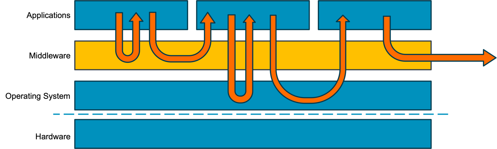
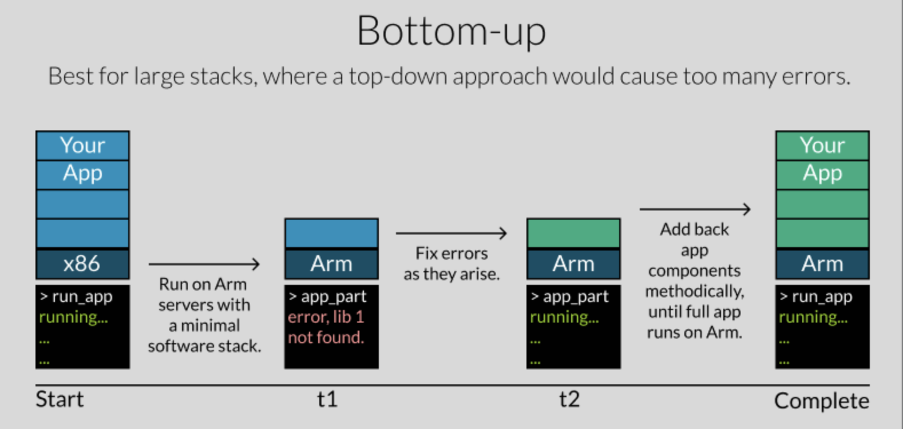
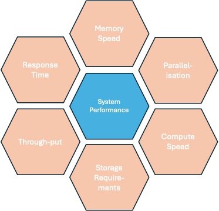
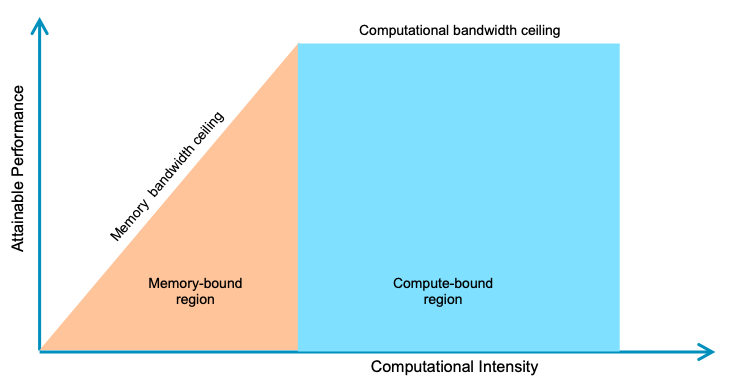
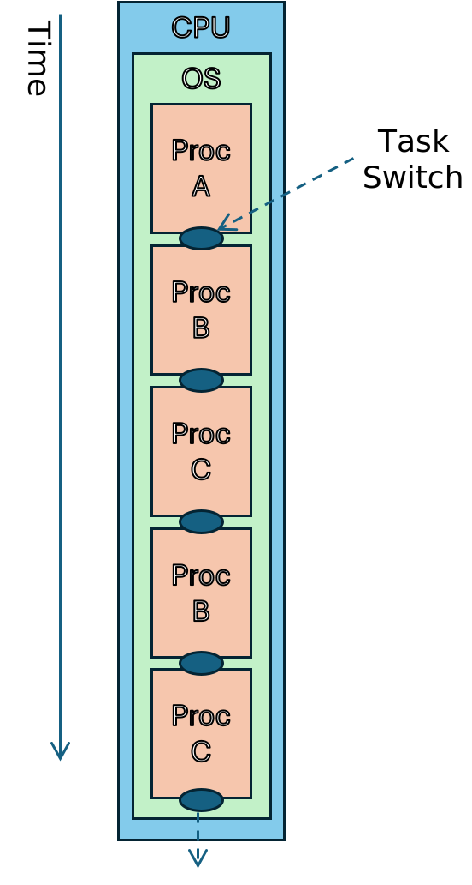
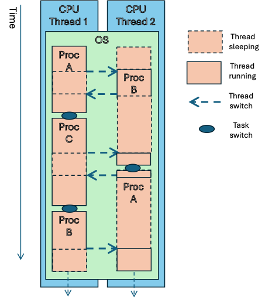
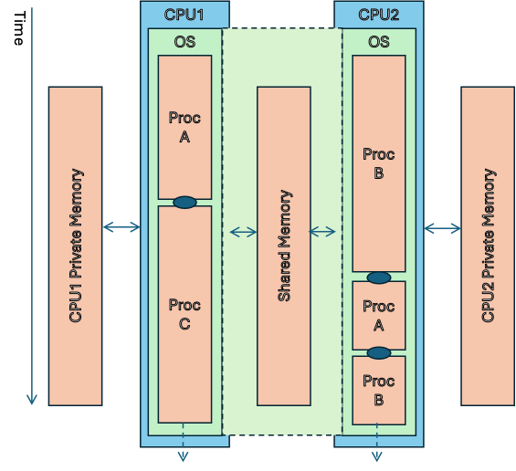
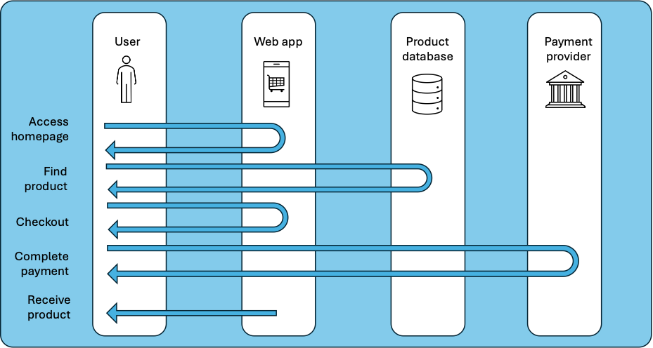
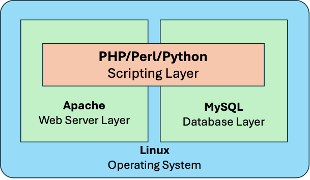
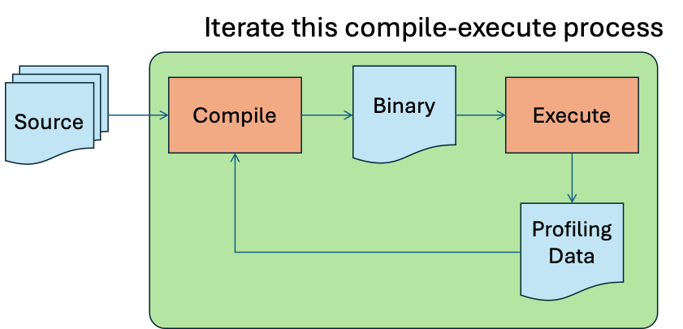

# Part 3 – Arm Neoverse Software and System Design

# 18.  Introduction

## 18.1  Brief Summary of Parts One and Two

The first two parts of this book provide an overview of the origins,
history and characteristics of Arm’s Neoverse processor cores. While a
detailed understanding of history may not be a requirement when looking
to deploy your own application, such an overview can provide valuable
insight into the reasoning behind some of the design decisions that have
gone into making Neoverse such a success in its target market.

In particular, a focus on factors such as power efficiency, adaptability
and customizability, and cost-efficiency have resulted in a range of
processing solutions that are uniquely suited to the huge diversity of
application to be found in the cloud today.

Earlier material also covered the design objectives behind the security
solutions adopted in Neoverse. These are intended to address problems
which are in many ways unique to the cloud environment, such as shared
ownership and usage models, the need to constantly reload and
reconfigure the software environment, and the significant diversity of
operating systems and hypervisors that are in use.

Crucially, the “clean sheet” that Arm provided with the Armv8-A
architecture (first implemented in Cortex-A and Cortex-X processors) has
allowed Arm’s partners to develop Neoverse systems that are not burdened
by the need to support decades of legacy hardware and software.[^1] This
unlocks benefits in efficiency and total cost of ownership (TCO) for
users.

## 18.2  The Benefits of Deploying on Arm Platforms in the Cloud

The benefits identified of deploying on Arm platforms in the cloud can
be summarized as follows:

An extensive and growing range of supported software components,
middleware, operating environments and development tools.

Easy access to a wide variety of cloud instances, providing a diversity
of performance and price point.

An architectural focus on power efficiency, which is more sustainable
and offers lower TCO.

A diversity of design and manufacturing options offers licensees the
ability to tune for specific use cases, leading to greater scalability
that can grow with your needs.

## 18.3  Common Arm Use Cases in the Cloud

There are extremely few use cases that cannot be supported
“out-of-the-box” on modern Arm processing platforms. However, there are
several common classes of application for which Arm is particularly
suitable.

Modern Arm processors are designed to be easily deployed with multiple
cores on a single processor. The memory architectures that they use are
optimized for multicore access to large amounts of shared on-device
memory, and the caches are designed for efficient sharing of frequently
used data between cores.

The latest Armv8 and Armv9 architectures incorporate features that are
designed to facilitate rapid context switches between multiple
applications on the same core, making these devices particularly
suitable for microservices, containerized and multi-tenant environments,
where rapid switching between multiple contexts is crucial.[^2]

The on-chip power and bus architectures used by Arm platforms allows
individual cores to be powered up and down quickly and efficiently,
making for highly power-efficient implementations which can rapidly
scale in response to changing processing demands.

These factors make Arm processing platforms particularly suitable for
high-traffic websites, and applications which need to support multiple
simultaneous connections.

The inherent power efficiency of Arm platforms makes them suitable for
deployment at the network edge, nearer to the IoT devices which are
often connected to and supported by cloud applications. These IoT
devices are commonly built on Arm architecture processing platforms, and
the commonality between an Arm-based cloud application and Arm-based IoT
devices allows for the possibility of testing entire Edge-to-Cloud
systems on a common platform in the cloud.[^3]

## 18.4  Objectives

The objectives of this document are to give a high-level overview of the
steps and processes involved in designing, developing, and deploying an
application in a cloud environment on an Arm Neoverse platform. On
completion, the reader should be aware of what is involved, where to
find software components, how to select a particular platform for
deployment, where to find appropriate development tools, and how to test
and deploy the final application.

This will be helpful for those seeking to migrate existing applications
as well as those looking to develop from scratch. It will also be of use
for both teachers and students in an academic setting.

While this document cannot claim to be comprehensive, it seeks to
provide sufficient information for further research to inform the
design, development, and deployment process.

## 18.5  Structure of This Document

Early parts of this document provide guidance on how to characterize the
proposed application. This covers subjects such as performance
requirements, memory and storage evaluation (size and speed), licensing
and billing, testing, and deployment.

These factors inform the choice of platform from the many which are
available, also the choice of components and tools that will be
incorporated into the process.

This is followed by an examination of three example applications. These
are chosen partly because they are common use cases, but also because
they provide the opportunity to illustrate typical decision processes
which are extensible to other application domains.

The three example applications are:

- A simple web-hosting use case;

- A video transcoding application;

- A framework for hosting and serving AI models.

In this section, extensive reference is made to practical resources
published on Arm’s website. These contain detailed instructions for
building and executing the example systems. A link to the key resources
concerned is included at the head of each section.

## 18.6  Pre-Requisites

It is possible (and useful) to read this document without access to any
of the components or tools used in the examples. However, much greater
value will be gained by the reader who has access to a suitable
environment in which these can be tried out as practical exercises.
Pointers are provided to full instructions for readers who are able to
do this.

## 18.7  Further Reading and Learning Resources

Arm and its ecosystem partners have generated much high-quality
documentation and training material. This list highlights some of the
resources that are available from Arm itself.

**Learning Resources**

[<u>https://learn.arm.com/learning-paths/servers-and-cloud-computing/</u>](https://learn.arm.com/learning-paths/servers-and-cloud-computing/)

- Learning resources on servers and cloud computing. These cover tools, application areas, containers, databases, ML, etc.

[<u>https://www.arm.com/markets/computing-infrastructure/arm-cloud-migration</u>](https://www.arm.com/markets/computing-infrastructure/arm-cloud-migration)

- The Arm Cloud Migration Program is a central resource for migrating any application to an Arm platform. This includes resources for “doing-it-yourself” as well as pointers to third-party migration services and the option to connect with Arm experts who can provide help and advice.

[<u>https://developer.arm.com/servers-and-cloud-computing/arm-cloud-migration</u>](https://developer.arm.com/servers-and-cloud-computing/arm-cloud-migration)

- Tools, tutorial and use cases to help with migrating workloads to Arm platforms.

**Libraries and Components**

[<u>https://developer.arm.com/ecosystem-dashboard/</u>](https://developer.arm.com/ecosystem-dashboard/)

- The Arm Software Ecosystem Dashboard is a comprehensive and constantly updated list of over 900 software components available for Arm platforms. The list can be sorted and filtered for specific application areas, licensing terms etc.

[<u>https://www.arm.com/markets/artificial-intelligence/software/kleidi</u>](https://www.arm.com/markets/artificial-intelligence/software/kleidi)

- The Arm Kleidi Libraries are a set of libraries optimized by Arm for optimal performance across a wide range of Machine Learning, Artificial Intelligence, and Computer Vision application domains. The libraries leverage Neoverse, NEON, SVE, and SME features when available on the target platform. They have already been integrated into many mainstream products.

[<u>https://developer.arm.com/ai</u>](https://developer.arm.com/ai)

- Resources, models, frameworks, tools, and libraries to help with optimizing AI workloads across all Arm-based platforms, including Neoverse in the cloud.

[<u>https://developer.arm.com/servers-and-cloud-computing/ai-cloud</u>](https://developer.arm.com/servers-and-cloud-computing/ai-cloud)

- Specific leaning resources to help cloud application developers at all levels and in all application domains.

[<u>https://developer.arm.com/servers-and-cloud-computing/arm-simd</u>](https://developer.arm.com/servers-and-cloud-computing/arm-simd)

- Learning resources to help with making best use of the SIMD capabilities of Arm platforms, including NEON, SME, SVE, and SVE2. Also, specific information on migrating code which is implemented for x86 platforms to A64.

# 19.  Writing or Migrating?

**<span class="smallcaps">Key Resource: Arm Migration Overview</span>
<u>(<https://learn.arm.com/migration>)</u>**

*An overview of how to migrate application to Arm Neoverse with links to
additional resources to support software developers.*

## 19.1  Migration Overview

While the end result of your project will be a working system executing
on an Arm platform, the place from which you start has an effect on the
process you will use to get there.

When developing an application “from scratch” a number of key decisions
will need to be made. Some of these are “functional”, e.g., what does
the system do, and how does it behave? Others are better referred to as
system properties or constraints, for example, how it must scale, how
many transactions it must be capable of handling in unit time, etc. Both
of these decisions will affect what components are most appropriate.
This might include choosing the operating system, selecting a database
engine, and so on.

When migrating an existing application to an Arm platform, many of these
decisions will already have been made as part of the original
development. For instance, if a database engine is needed, one will have
been selected based on the requirements of the application. It will then
have been integrated into the software stack. Since the majority of
popular database engines are supported on Arm platforms, it is likely
that this selection need not be revisited and the existing database
engine may be retained in the migrated application. This will simplify
development, integration, and testing as much prior work can be reused.
The key step here is to determine whether the existing database engine
is supported on the selected Arm platform.[^4]

Similarly, key decisions about operating system choice, task
decomposition, storage requirements, etc., may be retained during the
migration. Depending on how much of an existing system can be retained,
much of the early parts of the design process can be skipped.

However, a change of platform will necessarily result in a change of
performance characteristics. The change in the underlying processor,
memory architecture, and connectivity which will inevitably be involved
will all have an effect, large or small, on the performance of the
system. Some time, therefore, will need to be allocated to benchmarking
the working application, then to optimizing some components as
necessary.

For further information on how to successfully migrate an application to
an Arm platform, refer to the Arm Migration Overview mentioned above.
This document outlines two common approaches to migration:

- “top-down”, in which the entire stack is built on the new platform and
build errors are successively fixed until the stack build is complete
and runs correctly.[^5]

- “bottom-up”, in which the stack layers are built one-by-one from the
bottom to the top, fixing errors at each stage before continuing to the
next one.

These two approaches are illustrated in Figure 11 and Figure 12.



Figure 11 - A top-down migration approach ([<u>How can I migrate
applications to Arm Neoverse? \| Arm Learning
Paths</u>](https://learn.arm.com/migration/))



Figure 12 - A bottom-up migration approach ([<u>How can I migrate
applications to Arm Neoverse? \| Arm Learning
Paths</u>](https://learn.arm.com/migration/))

In general, the larger and more complex the stack, the more likely that
the bottom-up approach will be more suitable. For such a stack,
attempting to build all in one go in a top-down approach might result in
so many errors that the way forward is not obvious.

It may be the case that your system is implemented in a distributed
manner, i.e., different layers/functions are built separately and
deployed to different platforms which communicate and cooperate with
each other. In this case, it is much easier to rebuild the system in
steps by selecting separate stand-alone components which can be rebuilt
and then deployed to the new platform while leaving other components
unchanged. Over time, the entire application can be re-compiled and
re-deployed piece by piece. In this case, it often makes sense to start
with the simplest components in order to pipe-clean the new build
process.

Don’t forget that, regardless of how much or how little of the system
has changed during the migration, regression testing will always be
necessary!

## 19.2  Introducing the Arm MCP Server

**<span class="smallcaps">Key Resource: The Arm MCP Server</span>
<u>(<https://developer.arm.com/servers-and-cloud-computing/arm-mcp-server>)</u>**

**<span class="smallcaps">Key Resource: Learning Path - Automate
x86-to-Arm application migration using Arm MCP Server</span>
<u>(<https://learn.arm.com/learning-paths/servers-and-cloud-computing/arm-mcp-server/>)</u>**

Arm recently announced the Arm Model Context Protocol (MCP) Server. This
leverages the open MCP standard to integrate external tools and
knowledge sources into your AI assistant.[^6] For more details and a
tutorial on installation and usage of the tool in a variety of automated
development workflows, see the resources linked at the head of this
section.

# 20.  System Design Considerations

When designing an application, the intended function of the system, in
other words “what will it do?”, is usually the primary focus – this is
outside the scope of this document. There are several other properties
of the system which must also be considered, and which are within scope
here. These relate to properties of the system in addition to its
intended function.

For instance, questions such as “how fast must it respond to input?”,
“how many transactions is it expected to complete in a given time?”,
“what is an acceptable error rate in responses?”. To this list, we can
add other properties such as the amount of memory (both program memory
and data memory) that is required.

Sometimes, these factors can be derived prior to writing any code (e.g.,
from statistical analysis of known request rates and response times, or
from user-experience testing), or they can be calculated from static
inspection of the software (e.g., instruction and cycle counting in key
algorithms). In other cases, running code must be benchmarked (with or
without instrumentation) to measure the relevant values. If measured or
derived figures are out of the acceptable range, then, in what may be an
iterative process, some aspects of the design or implementation of the
application may have to be revisited.

## 20.1  Performance Requirements

The term “performance” is most often equated with speed of execution
but, in reality, it is much broader than that. While raw execution speed
is often an important parameter in a design, there are other properties
of a system which need to be considered. In this section, we look at the
properties of the system that shape these decisions most:

- Is the system performance dependent on processing power or memory speed?

- Can the system be parallelized to take advantage of the ability to
execute multiple software threads simultaneously?

- What is the required throughput of the system, for example, in terms of
transactions per unit time?

- What is the required response time of the system to external input? And
what constitutes a valid response in terms of the external interface?

Bear in mind that Arm processors are, in general, single-threaded and
that data center workloads tend to scale more linearly on such
platforms. Since SMT cores experience increased contention for shared
resources at higher utilizations, on such platforms it is common to set
a CPU usage threshold of c.50% utilization before triggering automatic
scaling to more processor cores.[^7] On non-SMT Arm Neoverse platforms,
it is safer to set the threshold somewhat higher, e.g., 70-80%, thus
saving on per-core licensing costs.

Figure 13 below shows some of the factors which may be at play in the
determination of suitable performance goals and metrics.



Figure 13 - Some factors which impact performance goals

When you have identified the required performance metrics, and the
factors which affect them, create realistic usage scenarios which can be
used to validate your assumptions and then benchmark and prove the
performance of the final system.

### 20.1.1  Compute-Bound or Memory-Bound

Since time is money, in many senses, higher execution speed is likely to
result in a more efficient use of compute resources which must be paid
for (whether in purchase cost or rental fees).

However, the speed of the processor is not the only factor that affects
the time it takes to carry out the functions of a system. Other factors
are also important, such as, for example: the time it takes to retrieve
data from a database, the time taken to receive input and transmit
output across a communications link, or the performance of attached
storage (which might be on-chip, off-chip, or off-line).

When selecting the most appropriate execution platform for a system, it
is important to determine whether the performance of the system depends
on the speed of the processor or the speed at which it can access data.
The former is referred to as “compute-bound”, the latter as
“memory-bound”. We touch on the related issue of “network-bound”, in
which the limiting factor is network bandwidth, in §20.20.3 below.

If a system is compute-bound, then a platform with higher execution
speed will likely result in improved performance; if memory-bound,
high-performance memory and larger memory bandwidth may have a larger
effect. In the first instance, consider the nature of the functions that
the system is carrying out. If it is simply retrieving and returning
data from a relatively simple database, then memory speed is likely to
be the limiting factor in performance; if it is carrying out some form
of processing or computation on the data, either after retrieval or
prior to storage, then (depending on the complexity of the computation)
compute speed may be more important. Figure 13 illustrates the
relationship between these concepts.[^8]



Figure 14 - Compute-bound vs Memory-bound

In practical terms, some form of profiling or modeling is likely the
best way to characterize the limiting factor in your system. For
instance, a profiler will be able to report how much time the processor
spends “idle”, waiting for input from internal or external sources.[^9]
If the processor is rarely idle, then it is likely that the system is
compute-bound and increasing the available processing power will improve
the performance of the system. Conversely, if the processor is spending
considerable amounts of time waiting then it is possible that the system
is memory-bound and faster memory interfaces may improve performance
(however, note that memory latency is not the only factor affecting
processor idle time – waiting for input from internal or external
sources is an equally likely explanation).

More detail on profiling is given in §26 below.

### 20.1.2  Parallelizability

Modern compute platforms are designed to handle multiple tasks
simultaneously. The Arm-based Neoverse processors found in many cloud
platforms are particularly efficient at doing this. They achieve this by
employing one or more of multi-tasking, multi-threading, and
multi-processing.



**Multi-tasking**

Multi-tasking operating systems, such as Linux or Windows, can switch
rapidly from one software task to another. This gives the illusion of
being able to execute multiple tasks simultaneously even though there is
only a single processor. At any one time, the processor is executing
instructions from one of the tasks in the system. A task switch occurs
in response to a number of possible events. These include:[^10]

- the currently executing task reaches the end of its defined function;

- the currently executing task cannot continue because it is waiting for
input from another task;

- the system must wait for a response from an external agent;

- the operating system determines that the currently executing task has
had a sufficient share of processor resources and initiates a switch to
another task;

- an external event results in a trigger to switch to a task which can
process that event.

Figure 15 - Multi-tasking

Figure 15 illustrates the switching between processes in a
single-processor, single-threaded multi-tasking system. There is a
single instance of the Operating System, executing on a single
processor. Only one process is executing at any one time. Task selection
and switching is done by the Operating System.

**Hardware Multi-threading**

A multi-threaded processor has execution hardware which can switch
extremely rapidly between two (or very occasionally more) execution
threads. This switching happens at a granularity that is too fine for
software control, e.g., when a particular instruction is blocked from
completing due to the need to wait for a response from the memory
system, or to wait for the result of another instruction. In such cases,
the execution unit can rapidly switch from the blocked thread to another
which can execute immediately. This feature allows the processor to
execute more than one thread simultaneously, in effect behaving as two
distinct processors running on a single hardware instance. The cost is
paid in larger and more expensive execution hardware.

In the main, Neoverse cores are single-threaded (one thread per core),
which, in general, yields better per-core performance than
multi-threaded competitor architectures. At the time of writing, the
Neoverse E1 is the only processor in the Neoverse family to support
hardware multi-threading, and is not available as a public cloud
instance.

> 

Figure 16 – Hardware Multi-threading

Figure 16 shows a simple example of hardware multi-threading on a single
CPU under a multi-tasking operating system. A single CPU runs a single
instance of a multi-tasking operating system. At hardware level, the CPU
can maintain two threads, each of which can be mapped to a separate
process by the operating system. Switches between threads are managed by
the CPU, at a level of granularity below the operating system. Switches
between tasks are managed by the operating system.

At any one time, one of the two threads is being executed by the CPU.

**Multiprocessing**

A multiprocessing system distributes the distinct software tasks
comprising a system across multiple physical processors. The performance
of such an approach relies heavily on the efficiency with which these
separate processors can share data. Generally, a single instance of the
operating system will execute across multiple processors, allowing them
to dynamically share software tasks and data.

All current cloud processing platforms are built from chips containing
more than one core. The number of cores per chip varies, considerably
but each core is identical. The on-chip interconnect and memory
architecture used by Neoverse implementations make it possible to share
code and data between processor cores on the same device very easily and
efficiently. There is clearly some increased latency involved in
accessing data, which is in shared memory, but intelligent caching
strategies improve this considerably.

>  style="width:4.81223in;height:4.41823in" />

Figure 17 - Symmetric Multi-processing

Figure 17 shows an example of symmetric multi-processing. What is, in
effect, a single instance of the operating system executes across a
number of processors simultaneously. Although executing independently,
they behave as a single instance because they share the operating system
data structures. Tasks, from a pool of executable tasks, are allocated
dynamically to each processor.

All of the above means that ensuring that a system is capable of
decomposition into a set of distinct tasks, which can, to some extent,
execute in parallel, and can have a dramatic effect on performance.

It is important to recognize that some parts of a software system may be
inherently non-parallelizable, while others may lend themselves
naturally to it. Cryptographic hashing algorithms, for example, are
often designed with the intention of making them very difficult to
parallelize.

There has been much material written on this topic throughout the
history of the computing industry and many of the problems are well
understood. In particular, pay attention to Amdahl’s Law (originally
formulated in 1967), which analyzes the cumulative effect of adding more
compute resource to a system.[^11]

### 20.1.3  Throughput

Throughput refers to the volume of work the system can carry out in a
specific time period. This might be measured in various ways, e.g.,
transactions-per-second, requests-per-minute, pixels-per-second, and so
on.

To establish the required throughput of the application, it is necessary
to construct typical usage scenarios. This might be done by estimating
the total user population, how many requests each user might make in a
given time period, the response time for each request, the total compute
resource required for each transaction, etc. From these, a theoretical
target for throughput can be derived.

If an existing, operational system is available, then real usage data
can be recorded and replayed to give an accurate idea of the performance
of the new system.

Remember that the maximum throughput of a system is not dependent only
on the available processing power.

See §25 and §26 below for more information on how these characteristics
might be measured. In addition, there is an Arm Learning Path which
provides a worked example of benchmarking and tuning network
performance.[^12]

### 20.1.4  Responsiveness

The responsiveness of the system relates to how quickly the system
responds to external input triggers. This will be made up of several
components, each of which will have different acceptable bounds and will
be affected by different aspects of the system.

Consider the process of purchasing an item from an online retailer.
Greatly simplified, this involves the following steps:

01. Locate and view the home page of the retailer.

02. Search for the desired item and put it in your shopping basket.

03. Checkout and pay.

04. Receive the delivered item.

The responsiveness of the system appears to the user in four distinct
stages:

1.  **The time to locate and view the home page**
    The user expects this response quickly as confirmation that the
    website is available and working, and that it is now waiting for the
    user to initiate a purchase. This response time is entirely
    dependent on the web application itself.[^13]

2.  **The time to find the desired product and put it in the basket**
    The user will wait longer for this response as the website is
    clearly functioning and will eventually return a response. The
    response time is dependent entirely on the web application,
    particularly on the time taken to search product databases.

3.  **The time to complete payment**
    The user will wait even longer for this as they have now committed
    to the purchase and often have low expectations for a speedy
    response at this stage. The response time is entirely dependent on
    the payment services provider and may involve, for example,
    two-factor authentication. No amount of optimization in the web
    application is likely to improve response time here. The only way to
    improve it would be to purchase a higher level of service guarantee
    from the payment service provider.

4.  **The time to receive the delivered item**
    Clearly, this is entirely out of the hands of the web developer and
    dependent completely on the performance of third-party shipping
    companies.



Figure 18 - Making a purchase

Figure 18 illustrates this process.

In a similar way, the responsiveness of your proposed software system
should be broken down into those components that are dependent on the
performance of your system alone, those that are partially dependent on
it, and those that are not dependent on it at all. It is important to
recognize that users will have different expectations of what is
perceived as acceptable for each of these and that your system only has
control over some of them—some matter more than others.

In the hypothetical purchasing scenario, the system designer should
focus most optimization effort on the initial response time of the home
page (since this is the key response to the user and is the most
dependent on the local system), and next, focus on the time to locate
the required product (since this is less important to the user and local
optimization has limited effect). The payment process depends
significantly on a third-party payment processing system. The response
time here is not under the developer’s complete control, however, some
local optimization might be productive. The shipping process is
determined entirely by third parties, so cannot be optimized at all.

## 20.2  Storage Requirements

The principal factors in determining storage requirements are:

- the amount and type of data needed;

- the speed at which the data can be accessed;

- the patterns in which the data is accessed during execution;

- whether access patterns are dominated by reading or writing data.

Consideration must also be given to whether a database engine is
required and, if so, which database architecture is the most
appropriate. This decision will have far-reaching implications for the
performance and functionality of the final application.

### 20.2.1  Speed

You will want to consider some or all of the following factors:

- the time taken to access a data item in response to a transaction;

- the necessary responsiveness of the system (see §20.1.4);

- the transaction rate (see §20.1.3),

Some of this estimation can be done as part of the system design, at
which time estimates will be available for information such as the
transaction rate and responsiveness. It is likely, though, that some
measurement will be necessary using the executing application itself.
For example, a profiler can be used to count memory transactions and
estimate how long each one takes.

Data can also be divided into that which must be accessed quickly (for
instance, data on which the initial user response depends), and that
which can be accessed more slowly. The former may need to be maintained
in an in-memory database, while the latter could be allocated to offline
disk storage. Available processor platforms will generally have a fixed
amount of fast on-chip storage.

Consider, too, the likely access pattern. For instance, an image held in
a frame buffer will be accessed in a predictable but non-linear pattern,
while an audio stream will be accessed in a strictly linear fashion. The
former will benefit from being held in a large enough area of fast
memory and will likely benefit from efficient caching, since many data
items will be accessed multiple times; the latter can likely be held in
a relatively small linear buffer and caching may well be less relevant
since each data item will only be accessed once.

### 20.2.2  Size

Some or all of the following factors will come into consideration:

- the amount of data required to service each transaction;

- the type and size of each data item;

- the amount of new data generated by each transaction;

- the transaction rate (see §20.1.3);

- the deletion rate of expired data;

- the retention policies which dictate for how long data must be stored;

- whether multiple copies of the data need to be stored for integrity and
backup reasons.

These factors (estimated or measured) can be used to derive the base
amount of storage, and the rate at which it grows or diminishes.

### 20.2.3  Choosing a Database Engine

Not all systems need or benefit from a database engine. For instance, a
file server or an image transcoder do not need the structured data
retrieval capabilities of a database. However, it is likely that all but
the simplest systems will rely on some kind of structured data which is
used in generating responses to user requests. Usually, there will be a
need to be able to write as well as read the data. User transactions, as
well as accessing existing data, will typically also generate new data
which will need storing in the database.

The type of database engine selected will be driven by the type,
structure (or lack of structure) and volume of the data being stored, as
well as how it is to be queried, accessed and updated. Highly structured
data will likely fit an SQL database engine better, while data which is
essentially a collection of random, unrelated items may suit a different
engine altogether.

When selecting a database engine, there may be external regulatory
requirements that drive the selection. For instance, highly-regulated
fields such as finance, medical, etc., may mandate some degree of ACID
compliance:

- **Atomicity**  
  Individual transactions can be treated as indivisible, i.e., either
  all elements of the transaction are completed or none of them are.
  This is important for applications such as accounting and banking.

- **Consistency**  
  This ensures that the database is always in a consistent and stable
  state. This has bearing, for instance, on the ability of the database
  to survive system failure while retaining its integrity. Also, that
  multiple agents accessing the database simultaneously will receive
  consistent results.

- **Isolation**  
  This refers to the requirement that individual transactions do not
  interfere with or affect other transactions that may be occurring at
  the same time. This may be crucial for any database where multiple
  agents are accessing it at the same time in response to concurrent
  user requests which are processed separately in a multi-processing
  system.

- **Durability**  
  This describes the ability of the database to survive various kinds of
  system failure e.g., power loss, or software malfunction. On a
  restart, the database must be in a stable and consistent state, ready
  to continue operation. Audit trails must make it possible to determine
  which transactions were completed and which were not before the
  interruption.

Database engines typically fall into two categories: SQL or NoSQL.[^14]

An SQL database engine implements a relational database in which data is
stored in structured tables consisting of rows and columns of data
items. The layout of the data, the way in which items relate to each
other, and the way in which the database can be searched (referred to as
the “schema”) are generally fixed at design time. SQL databases are
generally ACID compliant. They are accessed using the standard
Structured Query Language (SQL). Examples of SQL databases include
MySQL, PostgreSQL, and SQL Server.

A NoSQL database refers to one in which the data is stored in a less
structured and usually flexible, dynamic schema, for example as a graph
or tree. The type and format of data that can be stored is often more
varied than in an SQL database, and the schema can be changed
dynamically in response to changing storage requirements. For example,
different nodes in a graph structure may hold completely different types
of data to neighboring nodes. ACID compliance is not universal and, if
available, is sometimes harder to prove when trying to meet regulatory
requirements. Examples include MongoDB, Redis, Cassandra, and DynamoDB.

A brief summary of the differences between SQL and NoSQL is given in the
table:

| Feature        | SQL                        | NoSQL                     |
|----------------|----------------------------|---------------------------|
| Data structure | **Tables (rows/columns)**  | **Key-value**             |
| Schema         | **Fixed**                  | **Dynamic**               |
| Query language | **SQL (standard)**         | **Varies**                |
| ACID compliant | **Generally, yes**         | **Varies**                |
| Scalability    | **Within existing scheme** | **Flexible and scalable** |

SQL may be preferred if:

- the data exhibits a high degree of structure;

- complex joins and queries are to be used when accessing data;

- data integrity and consistency, e.g., ACID compliance, are important;

- the application domain is financial, medical, or legal.

NoSQL may be preferred if:

- the schema, layout and type of data stored is likely to change
dynamically;

- the data is less structured and individual data items are not
necessarily or obviously connected to other items;

- the application domain is real-time analytics, sensor data, or social
feeds.

Extensive guidance on database selection and configuration exists. All
of the major cloud service providers offer advice on database selection
and many have in-house or preferred database engines which are optimized
for their platforms.

The majority of popular database engines are available for Arm
platforms.[^15]

## 20.3  Networking/Communications

Like compute power, network resource is a chargeable commodity when
working in the cloud. System designers need to pay careful attention to
how much networking capacity is needed to avoid either
under-provisioning or paying for unused bandwidth. In addition to cost
considerations, it is important to ensure that networking bandwidth is
not the limiting factor in application performance (“network-bound”). No
amount of performance optimization on the source code will help improve
the performance of a network-bound application, whose performance is
dependent on the amount of network bandwidth available to it.

Factors which affect the amount and type of networking capability
include:

- **Bandwidth**  
  This can be measured using real or estimated values for the
  transaction rate and amount of data to be transferred per transaction.

- **Latency**  
  The responsiveness of the application can depend on the latency of the
  network connections used. Consider also whether network transmissions
  are particularly time-critical (e.g., time-series sensor data, video
  streams), or not (e.g., financial transactions, chat rooms).
  Time-sensitive data will require networking capability with known and
  low latency.

- **Security**
  The type and sensitivity of the data being transferred over a network
  in or out of the system will dictate the level of security that is
  appropriate. High-security algorithms often consume a great deal of
  processing power and time (therefore increasing latency and reducing
  responsiveness), so be careful not to over-provision. Bear in mind any
  regulatory requirements which may be relevant to the application
  domain (e.g., financial transactions, medical data etc.). It may be
  necessary to deploy a VPN solution such as Strongswan, or an
  encryption solution such as Zerotier.[^16]

- **Identity Management and Authentication**
  Some application domains may require careful attention to the identity
  and permissions of those accessing the system. Consider whether a
  bespoke, private identity management and authentication capability is
  required, or whether the system can leverage an existing, external
  solution.

- **Resilience**  
  Mission-critical applications may need to consider implementing some
  kind of redundancy or alternative provision to increase resilience in
  the event of system failure or external attack. External solutions,
  such as Cloudflare, may be considered.[^17]

## 20.4  Other Considerations

There are many other considerations which will influence the design of
an application. These are generally beyond the scope of this document
but may include some or all of the following examples.

**Quality of Service**

As well as parameters such as performance, latency and throughput,
Quality of Service (QoS) covers such considerations as reliability,
resilience, availability, and redundancy. When selecting a deployment
platform, these may influence your choice of provider, location,
connectivity, etc. All providers will publish their guarantees for
availability, amongst others, and their policies for resilience in the
event of failure.

**Deployment**

When considering a provider and a platform, financial and commercial
factors may come into play. For instance, the geographical region in
which you need your application to be available to users may influence
the region in which you seek out a suitable provider. Not all providers
are able to provide service in all locations, and you may elect to
deploy to multiple providers to cater for your market.

**Commercial/Financial/Legal**

As well as the Non-Recurring Expense (NRE) incurred in developing your
application, there will be ongoing costs for hosting, maintaining, and
servicing it post-deployment. This will influence the selection of
provider, platform, and billing model. In addition, some software
components, unlike those used in the examples in this document, are not
free to use and incur license and/or usage fees.

# 21.  Options for Building and Deployment

**<span class="smallcaps">Key Resource: Software Ecosystem
Dashboard</span>
<u>(<https://developer.arm.com/ecosystem-dashboard/>)</u>**

There are several options for putting together the desired software
stack and deploying the result to a Neoverse platform.

The easiest option is simply to install pre-built images. For example,
on a system running Ubuntu, this can be done by using the Advanced
Package Tool command, e.g., “sudo apt” to install the package direct
from the repository.

The majority of packages supported by Arm are available via this route,
which allows stacks to be assembled and configured quickly.

However, in order to optimize the software for particular platforms and
use cases, it is sometimes necessary to build the components from
source. For the majority of open source components, this is a
straightforward process and documentation will usually be found either
on the host website or in the relevant GitHub repository.

Building components from source offers greater flexibility but is more
involved and takes greater effort time and compute resource. Building a
large code base from source may take many hours (at least the first
time). A sensible approach would be to use pre-built components to test
feasibility and pipe-clean the chosen configuration before choosing to
build from scratch if further optimization proves to be necessary.

The approach taken in the following sections, which deal with specific
example applications, is to use pre-built components where available,
and then to provide pointers to instructions for building from source
should that be necessary.

Containerized application development is an approach, which is gaining
significant traction in the industry. Containers such as “docker”
simplify the process of building an application on one architecture and
targeting it for execution on another. “Multi-architecture” Docker
images contain multiple versions of the same application targeted at
different execution platforms, allowing a single application image to be
executed on a diverse range of platforms without modification.

For instance, an application might be built on an Arm-64-based platform
running Linux. The build process can output a single, containerized
image which can be deployed, for example, to a platform based on a
different ISA architecture and running Windows, or to an Arm64-based
platform running Linux, or to an Arm64-based platform running macOS.

The ability to decouple the need to build and deploy specifically and
separately for each architecture greatly simplifies development and
deployment pipelines.

# 22.  Example Application One – Web Hosting

**<span class="smallcaps">Key Resource: Learn How to Deploy Nginx</span>
([<u>https://learn.arm.com/learning-paths/servers-and-cloud-computing/nginx/</u>](https://learn.arm.com/learning-paths/servers-and-cloud-computing/nginx/))**

*This learning path is an introduction for engineers who want to use
Nginx on Arm.*

**<span class="smallcaps">Key Resource: Learn How to Deploy MySQL</span>
([<u>https://learn.arm.com/learning-paths/servers-and-cloud-computing/mysql/</u>](https://learn.arm.com/learning-paths/servers-and-cloud-computing/mysql/))**

*This learning path is an introduction for engineers who want to deploy
MySQL on Arm.*

In this example, we will examine how to deploy a basic web server,
capable of serving a simple SQL database.

Further information and detailed instructions on how to carry out some
of these steps can be found in the resources listed above.

## 22.1  Pre-requisites

You will need at least one Arm-based instance, either from a cloud
service provider or an on-premises server.

## 22.2  High-Level System Design

The number of possible component combinations from which a web server
stack might be assembled is huge and the possibilities quickly become
too many to count.

“LAMP” is an acronym that refers to a template software stack for a
“standard” web server.

L – Linux

A – Apache

M – MySQL

P – Perl, PHP or Python

Such a stack is illustrated in Figure 19.



Figure 19 - Example LAMP Stack

Many web server deployments are based on this, or on variants of it in
which components are substituted with alternative packages. For
instance, “WAMP” refers to a stack in which Linux has been replaced with
Windows as the underlying operating system. Similarly, “LEMP” refers to
a system in which Apache is replaced with Nginx. This latter
configuration is the one used here.

Nginx (pronounced “engine x”) is free and open source software that is
used by a large and growing proportion of deployed servers (as of 2025,
Nginx has the largest share of deployment for any single application in
cloud use cases).[^18] It is most commonly used as a web server but can
also be deployed as a reverse/mail proxy, load balancer, or HTTP cache.
The source code is available on GitHub and supports a number of commonly
used operating systems. It is lightweight compared to alternative
components, configurable and extensible.

## 22.3  Platform Selection and Configuration

The Arm example referenced above does not place any specific
requirements on the execution platform. The system as built is simple
enough not to require a high-performance platform.

For a “real-world” system, the choice of platform is influenced by one
or more of:

- **Company policy**
Your employer (or customer) may have reasons for favoring or selecting a particular platform provider. For instance, there may be existing licensing arrangements or company policies which encourage or even mandate one provider.

- **Software component support**
  As we have seen, the majority of components are well supported and maintained on a wide range of Arm platforms. However, if your choice of platform is influenced by other factors (see above), then the choice may be restricted to the components available on that platform. Similarly, the provider may have preferential support for particular components, e.g., Oracle offers Oracle Linux as a standard install on its platforms.[^19]

- **Platform availability**  
As noted earlier, not all platforms are available in all regions. Depending on the geographical deployment of your system, this may dictate some elements of the platform choice.

- **Nature of application**  
If your system is primarily retrieving and serving data from a database, then a platform which is optimized for memory access may be appropriate. If your system is carrying out significant computation on the data in transit, then a more powerful platform may be a better choice.

## 22.4  Component Selection[^20]

| Component | Supported on Arm | Version to use | Source |
|----|----|----|----|
| Nginx | **Since 2014** | **1.20.1 or later** | **[<u>https://nginx.org/en/download.html</u>](https://nginx.org/en/download.html)** |
| MySQL | **Since 2021** | **8.0.38 or later** | **[<u>https://dev.mysql.com/downloads/</u>](https://dev.mysql.com/downloads/)** |
| PHP | **Since 2020** | **8.0.0 or later** | **[<u>https://www.php.net/downloads.php</u>](https://www.php.net/downloads.php)** |

Links to Arm and third-party documentation can be found in the Arm
Software Ecosystem Dashboard on Arm’s website.

The links in the table above are to open source versions of the relevant
components. In many cases, commercial versions are also available.

## 22.5  Build, Install, Deploy

**<span class="smallcaps">Key Resource: PHP Installation:</span>
([<u>https://www.php.net/manual/en/install.unix.php</u>](https://www.php.net/manual/en/install.unix.php))**

*This is the standard documentation for installing PHP on Unix systems.*

**<span class="smallcaps">Key Resource: Nginx Installation:</span>
[<u>https://nginx.org/en/linux_packages.html</u>](https://nginx.org/en/linux_packages.html)**

*This is the standard documentation for installing Nginx on Unix
systems.*

**<span class="smallcaps">Key Resource: MySQL Installation:</span>
[<u>https://dev.mysql.com/doc/refman/8.4/en/linux-installation.html</u>](https://dev.mysql.com/doc/refman/8.4/en/linux-installation.html)**

*This is the standard documentation for installing MySQL on Linux
systems.*

The key decision here is whether to use pre-built components or to build
them from source. The latter approach involves more development work but
offers greater flexibility in optimizing the component for your platform
and for your application.

The referenced example deployment of Nginx documents both approaches.

A pragmatic approach may be to use pre-built components rapidly to put
together a functional system, then to re-build from sources if testing
and benchmarking indicates that specific optimization or customization
is required.

For widely-used components such as MySQL, many of the cloud providers
support their own deployment paths which can greatly simplify the
deployment. For instance, Amazon RDS is a MySQL-compatible database
engine optimized for AWS cloud platforms.[^21] If you are using an AWS
platform, selecting Amazon RDS for the database engine may simplify the
deployment process considerably (and there may also be price and
performance benefits).

### 22.5.1  Install Nginx

These instructions assume that you are using Ubuntu. Instructions for
other variants of Linux, including proprietary versions from cloud
service providers, can be found at
[<u>https://nginx.org/en/linux_packages.html</u>](https://nginx.org/en/linux_packages.html).

Install pre-requisites:

`sudo apt install curl gnupg2 ca-certificates lsb-release ubuntu-keyring`

Import an official nginx signing key so apt can verify the packages
authenticity. Fetch the key:
```
curl https://nginx.org/keys/nginx_signing.key \| gpg --dearmor \\
\| sudo tee /usr/share/keyrings/nginx-archive-keyring.gpg \>/dev/null
```
Verify that the downloaded file contains the proper key:
```
gpg --dry-run --quiet --no-keyring --import --import-options import-show
/usr/share/keyrings/nginx-archive-keyring.gpg
```
The output should contain the full
fingerprint `573BFD6B3D8FBC641079A6ABABF5BD827BD9BF62` as follows:[^22]

```
pub rsa2048 2011-08-19 \[SC\] \[expires: 2027-05-24\]  
573BFD6B3D8FBC641079A6ABABF5BD827BD9BF62

uid nginx signing key \<signing-key@nginx.com\>
```
Note that the output can contain other keys used to sign the packages.

To set up the apt repository for stable nginx packages, run the
following command:

```
echo "deb \[signed-by=/usr/share/keyrings/nginx-archive-keyring.gpg\]
\\  
http://nginx.org/packages/ubuntu \lsb_release -cs\ nginx" \\  
\| sudo tee /etc/apt/sources.list.d/nginx.list
```
If you would like to use mainline nginx packages, run the following
command instead:
```
echo "deb \[signed-by=/usr/share/keyrings/nginx-archive-keyring.gpg\]
http://nginx.org/packages/mainline/ubuntu \lsb_release -cs\ nginx"
\\  
\| sudo tee /etc/apt/sources.list.d/nginx.list
```
Set up repository pinning to prefer the chosen packages over
distribution-provided ones:
```
echo -e "Package: \*\nPin: origin nginx.org\nPin: release
o=nginx\nPin-Priority: 900\n" \\  
\| sudo tee /etc/apt/preferences.d/99nginx
```
To install nginx, run the following commands:

`sudo apt update`

`sudo apt install nginx`

### 25.5.2  Check the nginx version and build configuration

It can be useful to have details of exactly which version has been
installed. The useful Nginx “version” command will give you all this
information together with a set of compiler build options which you can
use to rebuild from source should that prove necessary in future.

Run the following command:

`nginx -V`

This command will produce output similar to the following.[^23] The
“`--with-cc-opt`” output shows the compiler flags which can be used to
rebuild from source. The output also shows which version of OpenSSL has
been incorporated into the build.
```
Nginx version: nginx/1.18.0

built with OpeSSL 3.0.2 15 March 202

TLS SNI support enabled

configure arguments: - - with-cc-opt=’-g -O2
–ffile-prefix-map=/build/nginx-glNPk0/nginx-1.18.0=. -flto=auto
```
Enable and start nginx:

`sudo systemctl enable nginx`

`sudo systemctl start nginx`

Instructions for rebuilding from source can be found here:

[<u>https://learn.arm.com/learning-paths/servers-and-cloud-computing/nginx/build_from_source/</u>](https://learn.arm.com/learning-paths/servers-and-cloud-computing/nginx/build_from_source/)

The same example on Arm’s website also shows how to then configure Nginx
as a static file server, reverse proxy, or API gateway.

### 22.5.3  Install MySQL

The following instructions are extracted from the full detailed
documentation for MySQL, which can be found at
[<u>https://dev.mysql.com/doc/refman/8.4/en/</u>](https://dev.mysql.com/doc/refman/8.4/en/)

Locate and download the appropriate version from MySQL APT repository at
[<u>https://dev.mysql.com/downloads/repo/apt/</u>](https://dev.mysql.com/downloads/repo/apt/).

Install the downloaded package. You will need to replace the version
information with the relevant information for the package if you have
downloaded a different version. You may also need to specify a pathname
for the package if it is not in the current directory.

`\$\> sudo dpkg -i ./mysql-apt-config_0.8.34-1_all.deb`

The installation process will query which versions and which optional
components you would like to install. If you are unsure, accept all of
the default options.

Update the package information:

`\$\> sudo apt-get update`

Install MySQL with APT:

`\$\> sudo apt-get install mysql-server`

Additional components can now be installed using the same procedure.
Details are in the documentation referenced above.

The above instructions will also install the mysql monitor and you can
now use the CLI tool mysql to create, connect to, and manipulate
databases.

### 22.5.4  Install PHP

Run the following commands to update the package lists and install PHP.
The module for connecting PHP and MySQL is installed.

`sudo apt update`

`sudo apt install -y php-fpm php-mysql`

### 22.5.5  Configure Nginx to use PHP

Using your favorite text editor, edit the default configuration file
at  
/etc/nginx/sites-available/default to add the following:
```
server {

listen 80 default server;

listen \[::\]:80 default_server;

server_name \_;

index index.php index.html index.htm index.nginx.htm;

location / {

try_files \$uri \$uri/ =404;

}

\#pass PHP scripts to FastCGI server

location ~ \\php\$ {

include snippets/fastcgi-php.conf;

fastcgi_pass unix:/run/php/php8.1-fpm.sock;

}

location ~ /\\ht {

deny all;

}

}
```
Restart Nginx:

`sudo systemctl restart nginx`

### 22.5.6  Test the Stack

To test the stack, create a simple PHP file and make sure that the page
renders properly.

Create a file named info.php in the /var/www/html containing a simple
phpinfo call.
```
sudo chmod -R 777 /var/www/html

echo "\<?php phpinfo(); ?\>" \>\> /var/www/html/info.php
```

Visit: [<u>http://localhost/info.php</u>](http://localhost/info.php) and
the PHP info page should appear confirming the details of the
installation.

### 22.5.7  Key takeaways

All the necessary components for this application are easily accessible
as open source and can easily be installed on any given Linux system.
While all are available as binaries, they can also be built from source
if necessary. Integration and assembly of the software stack is largely
achieved by simple scripting since the APIs are standard. Arm’s Learning
Path provides a simple framework to get you started.

# 23.  Example Application Two – Video Transcoding

**<span class="smallcaps">Key Resource: Run x265 on Arm servers</span>
([<u>https://learn.arm.com/learning-paths/servers-and-cloud-computing/codec/</u>](https://learn.arm.com/learning-paths/servers-and-cloud-computing/codec/))**

*This Learning Path is an introduction for software developers who want
to build and run an x265 codec on Arm servers and measure performance.*

In this example, we will build and test a video transcoder application.
This will take a short video file and encode it using a standard
encoding scheme. The resulting encoded file is significantly smaller
than the original, with minimal loss of image quality.

## 23.1  Pre-Requisites

You will need at least one Arm-based instance, either from a cloud
service provider or an on-premises server.

This example assumes that the platform is running Ubuntu (20.04 or
later), though the technique should work with any mainstream Linux
variant. We will also be building the codec direct from source code and
we will use `gcc` and `cmake` for this (instructions for installing these
are included and may be ignored if they are already installed).

## 23.2  High-Level System Design

The codec used for this example is x265. This is an open-source
H.265/HEVC codec, designed by the Motion Picture Experts Group (MPEG).
Although, when compared to its predecessor H.264, it requires greater
processing power when running, H.265 offers greater data compression for
the same video quality. Recent efforts have optimized this package for
Neoverse platforms, particularly those platforms which support the NEON
instruction set.[^24]

The source code repository is hosted on Bitbucket (bitbucket.org).

## 23.3  Platform Selection and Configuration

In addition to the considerations outlined in §22.3 in relation to the
webserver example, note that a codec application will likely, by its
very nature, require:

- greater input and output bandwidth for the incoming and outgoing video
stream;

- more and faster local storage for frame buffers;

- greater, and more specialized processing power.

These will be important considerations when selecting a platform.

Additionally, H.265 is capable of making use of parallel processing in a
way in which its predecessor cannot. Specifically, the input frame is
divided into regions which can be processed entirely separately, on
separate processors which share the same frame buffer. This means that
multicore platforms should perform better for H.265.

## 23.4  Component Selection

<table>
<colgroup>
<col style="width: 18%" />
<col style="width: 20%" />
<col style="width: 18%" />
<col style="width: 41%" />
</colgroup>
<thead>
<tr>
<th>Component</th>
<th>Supported on Arm</th>
<th>Version to use</th>
<th>Source</th>
</tr>
</thead>
<tbody>
<tr>
<td>x265</td>
<td><strong>Since 2020</strong></td>
<td><strong>3.4 or later</strong></td>
<td><a
href="https://bitbucket.org/multicoreware/x265_git/wiki/Home"><strong><u>https://bitbucket.org/multicoreware<br />
/x265_git/wiki/Home</u></strong></a></td>
</tr>
<tr>
<td>Gcc</td>
<td><strong>Since 2018</strong></td>
<td><strong>15.0 or later</strong></td>
<td><strong>Available on all Linux distros</strong></td>
</tr>
<tr>
<td>cmake</td>
<td><strong>Since 2021</strong></td>
<td><strong>3.19.3 or later</strong></td>
<td><strong>Available on all Linux distros</strong></td>
</tr>
</tbody>
</table>

Links to Arm and third-party documentation on these components can be
found in the Arm Software Ecosystem Dashboard on Arm’s website.

The links in the table above are to open-source versions of the relevant
components. In many cases, commercial versions are also available.

## 23.5  Build, Install, Deploy

### 23.5.1  Install `gcc`

The following instructions assume that you are using Ubuntu.
Instructions for other variants of Unix can be found at
<u><https://learn.arm.com/install-guides/gcc/native/>.</u>

`sudo apt update`

`sudo apt install gcc g++ -y`

`sudo apt install build-essential -y`

Confirm that the installation is complete and determine the version:

`gcc –version`

### 23.5.2  Install `cmake`

`sudo apt update`

`sudo apt install wget git cmake cmake-curses-gui build-essential -y`

### 23.5.3  Download and Build x265

Clone the repository from
[<u>bitbucket.org</u>](https://bitbucket.org/multicoreware/x265_git/wiki/Home)

`git clone https://bitbucket.org/multicoreware/x265_git.git`

`cd x265_git/build/linux`

Set default flags for the build, then run `make` to build the codec.

`./make-Makefiles.bash`

`Make`

### 23.5.4  Download Test Video Streams

Video streams which can be used for testing the codec are taken from the
publicly available Google User Generated Content (UGC) dataset. This
dataset comprises some 1500 video clips, totaling 500 minutes of content
of varying quality, bitrate, resolution, and content. We will use the
360P and 1080P files.
```
wget
[<u>https://storage.googleapis.com/ugc</u>](https://storage.googleapis.com/ugc)
\\  
dataset/original_videos/Sports/360P/Sports_360P-02c3.mkv
```

```
wget
[<u>https://storage.googleapis.com/ugc</u>](https://storage.googleapis.com/ugc)
\\  
dataset/original_videos/Sports/1080P/Sports_1080P-0640.mkv
```

### 23.5.5  Run the Codec and Measure the Performance

The following command runs the codec on 50 frames of 360P video:
```
./x265 --preset ultrafast --frames 50 Sports_360P-02c3.mkv \\  
--input-res 640x360 --fps 24 --output outfile.265  
--frame-threads 1 --no-wpp --pools ','
```
The following command runs the codec on 50 frames of 1080P video:
```
./x265 --preset ultrafast --frames 50 Sports_1080P-0640.mkv \\  
--input-res 1920x1080 --fps 24 --output outfile.265 \\  
--frame-threads 1 --no-wpp --pools ','
```
Note the following options which are used to control the level of
concurrency employed by the codec:

**--frame-threads 1**
This option specifies that one frame at a time is processed, with no
concurrency. Due to the improved motion compensation, quality will
generally be slightly higher and compression slightly better. However,
performance is reduced as multi-processing and/or multi-threading cannot
be used. Other values are possible: a value of 0 instructs the program
to auto-detect and select an appropriate level of concurrency; values
between 1 and 16 set the required level. Experimentation will show the
optimal level for your platform. You should find that, beyond a certain
point, memory use will increase but performance will not.

**--no-wpp**
This disables Wavefront Parallel Processing (WPP), preventing the codec
from beginning to process a new row before previous rows have been
completed. Removing it (or specifying `‑‑wpp`) will increase potential
parallelism at the expense of a slight reduction in compression
efficiency.

**--pools**
This option has (fairly complicated) syntax allowing the user to specify
the number of threads allocated to each node. The default (used here)
specifies that no thread pool is created.

More detail on these and the many more command line options can be found
in the official documentation at:
<u>https://x265.readthedocs.io/en/master/introduction.html.</u>

The output from the command will display what parameters were used
(including default values for those not specified on the command line),
together with metrics indicating the performance of the codec. The most
useful metrics are usually reported in the last line:

`Encoded 50 frames in 13.74s (3.64s fps), 15933.41 kb/s, Avg QP: 34.47`

This line includes the:

- number of frames encoded;

- total time taken;

- calculated “frames per second” figure (fps);

- average data throughput in kilobytes/second (kb/s);

- average Quantization Parameter (QP), an indication of the compression
efficiency - higher QP indicates more aggressive quantization, leading
to greater compression but lower quality.

It is relatively easy to adjust several of these parameters and observe
the differences in performance. However, to go further than this, some
form of code optimization will be required. There will be more to say on
this subject in §26 below.

### 23.5.6  Key Takeaways

Video transcoding is a highly complex and compute-intensive process.
However, easily accessible standard components make this technology easy
to deploy. Standard installation tools and build scripts make building
from source easy for any platform. To carry out tests, sample files are
available online.

# 24.  Example Application Three - AI Model Serving

**<span class="smallcaps">Key Resource: Deploy a RAG-based
Chatbot</span>
([<u>https://learn.arm.com/learning-paths/servers-and-cloud-computing/rag/</u>](https://learn.arm.com/learning-paths/servers-and-cloud-computing/rag/))**

*This Learning Path is an introduction for software developers, ML
engineers, and those looking to deploy production-ready LLM chatbots
with Retrieval Augmented Generation (RAG) capabilities, knowledge base
integration, and performance optimization for Arm Architecture.*

In this example, we will build and test a simple Retrieval Augmented
Generation (RAG)-enabled chatbot. We will use an open source LLM which
has been optimized for Arm.

## 24.1  Pre-requisites

Due to the higher processing power requirements of LLM software, the
requirements for the target platform are somewhat more demanding than
the earlier examples. You will need access to an Arm64 platform with at
least 16 cores, 8GB of RAM and 32GB of disk space.

The example assumes that you are running Ubuntu Linux.

## 24.2  High-Level System Design

The llama.cpp which is installed in this example makes use of Arm’s
Kleidi AI libraries, which are optimized for acceleration of Computer
Vision (CV) and Machine Learning (ML) applications on Arm platforms.

You can find out more information about KleidiAI here:
[<u>https://www.arm.com/markets/artificial-intelligence/software/kleidi</u>](https://www.arm.com/markets/artificial-intelligence/software/kleidi)

## 24.3  Platform Selection & Configuration

You will need access to an Arm64 platform with at least 16 cores, 8GB of
RAM and 32GB of disk space.

## 24.4  Component Selection

| Component | Supported on Arm | Version to use | Source |
|----|----|----|----|
| Python | **Since 2012** | **3.11.0 or later** | **Available on all Linux distros** |
| llama-cpp-python | **Since 2018** | **15.0 or later** | **abetlen.github.io/llama-cpp-python/whl/cpu** |
| llama.cpp | **Since 2021** | **3.19.3 or later** | **Installed with the above** |

Links to Arm and third-party documentation on these components can be
found in the Arm Software Ecosystem Dashboard on Arm’s website.[^25]

The table above refers to the open source versions of the relevant
components used in the example. In many cases, commercial versions are
also available.

## 24.5  Build, Install, Deploy

### 24.5.1  Install Build Tools

The instructions for installing `gcc` and `cmake` can be found in §23.5.1
and §23.5.2.

### 24.5.2  Install Python

Run the following commands to install Python and relevant dependencies.

`sudo apt update`

`sudo apt install python3-pip python3-venv cmake -y`

### 24.5.3.  Create a Requirements File

Using a text editor, add the following to requirements.txt.

```
\# Core LLM & RAG Components

langchain==0.1.16

langchain_community==0.0.38

langchainhub==0.1.20

\# Vector Database & Embeddings

faiss-cpu

sentence-transformers

\# Document Processing

pypdf

PyPDF2

lxml

\# API and Web Interface

flask

requests

flask_cors

streamlit

\# Environment and Utils

argparse

python-dotenv==1.0.1
```

### 24.5.4  Create, Activate and Install the Python Environment

Run the following commands:
```
python3 -m venv rag-env

source rag-env/bin/activate

pip install -r requirements.txt
```

### 24.5.5  Install llama.cpp

The following command installs the llama.cpp backend, included in the
Python binding.

```
pip install llama-cpp-python --extra-index-url \\  
https://abetlen.github.io/llama-cpp-python/whl/cpu
```

### 24.5.6  Download and Build the Model

```
mkdir models

cd models

wget https://huggingface.co/chatpdflocal/\\  
llama3.1-8b-gguf/resolve/main/ggml-model-Q4_K_M.gguf

cd ~

git clone https://github.com/ggerganov/llama.cp

cd llama.cpp

mkdir build

cd build

cmake .. -DCMAKE_CXX_FLAGS="-mcpu=native" -DCMAKE_C_FLAGS="-mcpu=native"

cmake --build . -v --config Release -j \nproc\

cd bin

./llama-quantize --allow-requantize ../../../models/\\  
ggml-model-Q4_K_M.gguf ../../../models/\\  
llama3.1-8b-instruct.Q4_0_arm.gguf Q4_0
```

The first set of commands downloads the model source, the second set of
commands builds the library (to run on CPU only, with no GPU
acceleration), and the third set quantizes the model.

Quantization is a technique used to reduce the file size and memory
usage for a particular model. In this case, 4-bit quantization is used.
By default, the model uses 32-bit floating-point weights. These weights,
as well as being large, require considerably more computing resource to
handle. Using a 4-bit integer representation reduces the memory
requirements as well as speeding up the arithmetic considerably as
integer math can be used. Quantization is always a trade-off between
size and accuracy, since quantization loses some of the resolution of
each weight.

### 24.5.7  Configure and Start the Backend Server

Using a text editor, create a file backend.py with the following
content.[^26]

```
import os

import time

import logging

from flask import Flask, request, jsonify

from flask_cors import CORS

from langchain_community.vectorstores import FAISS

from langchain_community.embeddings import HuggingFaceEmbeddings

from langchain_community.llms import LlamaCpp

from langchain_core.callbacks import StreamingStdOutCallbackHandler

from langchain_core.prompts import PromptTemplate

from langchain_community.document_loaders import PyPDFLoader,\\  
DirectoryLoader

from langchain_text_splitters import HTMLHeaderTextSplitter,\\  
CharacterTextSplitter

from langchain.schema.runnable import RunnablePassthrough

from langchain_core.output_parsers import StrOutputParser

from langchain_core.runnables import ConfigurableField

\# Configure logging

logging.getLogger('watchdog').setLevel(logging.ERROR)

logger = logging.getLogger(\_\_name\_\_)

\# Initialize Flask app

app = Flask(\_\_name\_\_)

CORS(app)

\# Configure paths

BASE_PATH = "\$HOME"

TEMP_DIR = os.path.join(BASE_PATH, "temp")

VECTOR_DIR = os.path.join(BASE_PATH, "vector")

MODEL_PATH = os.path.join(BASE_PATH,
"models/llama3.1-8b-instruct.Q4_0_arm.gguf")

\# Ensure directories exist

os.makedirs(TEMP_DIR, exist_ok=True)

os.makedirs(VECTOR_DIR, exist_ok=True)

\# Token Streaming

class StreamingCallback(StreamingStdOutCallbackHandler):

def \_\_init\_\_(self):

super().\_\_init\_\_()

self.tokens = \[\]

self.start_time = None

def on_llm_start(self, \*args, \*\*kwargs):

self.start_time = time.time()

self.tokens = \[\]

print("\nLLM Started generating response...", flush=True)

def on_llm_new_token(self, token: str, \*\*kwargs):

self.tokens.append(token)

print(token, end="", flush=True)

def on_llm_end(self, \*args, \*\*kwargs):

end_time = time.time()

duration = end_time - self.start_time

print(f"\nLLM finished generating response in {duration:.2f}\\  
seconds", flush=True)

def format_docs(docs):

return "\n\n".join(doc.page_content for doc in docs).replace("Context:",
"").strip()

\# Vectordb creating API

@app.route('/create_vectordb', methods=\['POST'\])

def create_vectordb():

try:

data = request.json

vector_name = data\['vector_name'\]

chunk_size = int(data\['chunk_size'\])

doc_type = data\['doc_type'\]

vector_path = os.path.join(VECTOR_DIR, vector_name)

\# Process document

chunk_overlap = 30

if doc_type == "PDF":

loader = DirectoryLoader(TEMP_DIR, glob='\*.pdf',\\  
loader_cls=PyPDFLoader)

docs = loader.load()

elif doc_type == "HTML":

url = data\['url'\]

splitter = HTMLHeaderTextSplitter(\[

("h1", "Header 1"), ("h2", "Header 2"),

("h3", "Header 3"), ("h4", "Header 4")

\])

docs = splitter.split_text_from_url(url)

else:

return jsonify({"error": "Unsupported document type"}), 400

\# Create vectorstore

text_splitter = CharacterTextSplitter(

chunk_size=chunk_size,

chunk_overlap=chunk_overlap

)

split_docs = text_splitter.split_documents(docs)

embedding = HuggingFaceEmbeddings(model_name="thenlper/gte-base")

vectorstore = FAISS.from_documents(documents=split_docs,\\  
embedding=embedding)

vectorstore.save_local(vector_path)

return jsonify({"status": "success", "path": vector_path})

except Exception as e:

logger.exception("Error creating vector database")

return jsonify({"error": str(e)}), 500

\# Query API

@app.route('/query', methods=\['POST'\])

def query():

try:

data = request.json

question = data\['question'\]

vector_path = data.get('vector_path')

use_vectordb = data.get('use_vectordb', False)

\# Initialize LLM

callbacks = \[StreamingCallback()\]

model = LlamaCpp(

model_path=MODEL_PATH,

temperature=0.1,

max_tokens=1024,

n_batch=2048,

callbacks=callbacks,

n_ctx=10000,

n_threads=64,

n_threads_batch=64

)

\# Create chain

if use_vectordb and vector_path:

embedding = HuggingFaceEmbeddings(model_name=\\  
"thenlper/gte-base")

vectorstore = FAISS.load_local(vector_path, embedding,\\  
allow_dangerous_deserialization=True)

retriever = vectorstore.as_retriever().configurable_fields(

search_kwargs=ConfigurableField(id="search_kwargs")

).with_config({"search_kwargs": {"k": 5}})

template =
"""\<\|begin_of_text\|\>\<\|start_header_id\|\>system\<\|end_header_id\|\>

You are a helpful assistant. Use the following context to\\  
answer the question.

Context: {context}

Question: {question}

Answer: \<\|eot_id\|\>"""

prompt = PromptTemplate(template=template,\\  
input_variables=\["context", "question"\])

chain = (

{"context": retriever \| format_docs, "question":\\  
RunnablePassthrough()}

\| prompt

\| model

\| StrOutputParser()

)

else:

template =
"""\<\|begin_of_text\|\>\<\|start_header_id\|\>system\<\|end_header_id\|\>

Question: {question}

Answer: \<\|eot_id\|\>"""

prompt = PromptTemplate(template=template,\\  
input_variables=\["question"\])

chain = RunnablePassthrough().assign(question=lambda x: x) \|\\  
prompt \| model \| StrOutputParser()

\# Generate response

response = chain.invoke(question)

return jsonify({"answer": response})

except Exception as e:

logger.exception("Error processing query")

return jsonify({"error": str(e)}), 500

\# File Upload API

@app.route('/upload_file', methods=\['POST'\])

def upload_file():

try:

file = request.files\['file'\]

if file and file.filename.endswith('.pdf'):

filename = os.path.join(TEMP_DIR, "uploaded.pdf")

file.save(filename)

return jsonify({"status": "success", "path": filename})

return jsonify({"error": "Invalid file"}), 400

except Exception as e:

logger.exception("Error uploading file")

return jsonify({"error": str(e)}), 500

if \_\_name\_\_ == '\_\_main\_\_':

app.run(host='0.0.0.0', port=5000, debug=True)
```

Run the following command to start the backend server.

`python3 backend.py`

The output should confirm that the server is now running. You are now
ready to configure and start the frontend server.

### 24.5.8  Configure the Frontend Server

Using a text editor, create a file frontend.py with the following
content.[^27]

```
import os

import requests

import time

import streamlit as st

from PIL import Image

from typing import Dict, Any

\# Configure paths and URLs

BASE_PATH = "\$HOME"

API_URL = "http://localhost:5000"

\# Page config

st.set_page_config(

page_title="LLM RAG on Arm Neoverse CPU"

)

\# Title

st.title("LLM RAG on Arm Neoverse CPU")

\# Sidebar

with st.sidebar:

st.write("## Model Settings")

model = st.selectbox('Select LLM',
\["llama3.1-8b-instruct.Q4_0_arm.gguf"\])

use_vectordb = st.checkbox("Use Vector Database")

\# Initialize session state

if 'messages' not in st.session_state:

st.session_state.messages = \[\]

if 'vectordb_path' not in st.session_state:

st.session_state.vectordb_path = None

\# Vector Database Creation

if use_vectordb:

st.sidebar.write("## Vector Database")

\# First select vector store type

vector_store = st.sidebar.selectbox("Vector Storage Type", \["FAISS"\])

\# Then select action

action = st.sidebar.radio("Action", \["Create New Store", "Load \\  
Existing Store"\])

if action == "Create New Store":

source = st.sidebar.radio("Source", \["PDF"\])

if source == "PDF":

uploaded_file = st.sidebar.file_uploader("Upload PDF",\\  
type="pdf")

if uploaded_file:

files = {'file': uploaded_file}

response = requests.post(f"{API_URL}/upload_file",\\  
files=files)

if response.ok:

st.sidebar.success("File uploaded successfully")

db_name = st.sidebar.text_input("Vector Index Name")

if st.sidebar.button("Create Index"):

response = requests.post(

f"{API_URL}/create_vectordb",

json={

"vector_name": db_name,

"chunk_size": 400,

"doc_type": "PDF"

}

)

if response.ok:

st.session_state.vectordb_path = \\  
response.json()\['path'\]

st.sidebar.success("Vector Index created!")

else:

st.sidebar.error("Failed to create vector \\  
Index")

else: \# Load Existing

\# Updated directory handling

vector_dir = os.path.join(BASE_PATH, "vector")

if os.path.exists(vector_dir):

\# Get all directories that contain FAISS index files

dbs = \[\]

for root, dirs, files in os.walk(vector_dir):

if "index.faiss" in files: \# Check for FAISS index file

\# Get relative path from vector_dir

rel_path = os.path.relpath(root, vector_dir)

dbs.append(rel_path)

if dbs:

selected_db = st.sidebar.selectbox("Select Index", dbs)

st.session_state.vectordb_path = os.path.join(vector_dir,\\  
selected_db)

st.sidebar.success(f"Loaded index: {selected_db}")

else:

st.sidebar.warning("No existing indexes found. \\  
Please create a new one.")

else:

\# Create vector directory if it doesn't exist

os.makedirs(vector_dir, exist_ok=True)

st.sidebar.warning("No indexes found. \\  
Please create a new one.")

\# Chat interface

if use_vectordb and action == "Load Existing Store" and dbs:

if prompt := st.chat_input("Ask a question"):

st.session_state.messages.append({"role": "user", "content": \\  
prompt})

\# Display messages

for msg in st.session_state.messages:

with st.chat_message(msg\["role"\]):

st.write(msg\["content"\])

\# Get response

with st.chat_message("assistant"):

response = requests.post(

f"{API_URL}/query",

json={

"question": prompt,

"vector_path": st.session_state.vectordb_path,

"use_vectordb": use_vectordb

}

)

if response.ok:

answer = response.json()\['answer'\]

st.write(answer)

st.session_state.messages.append({"role": "assistant",\\  
"content": answer})

else:

st.error("Failed to get response from the model")
```

Run the following command to start the frontend server:

`python3 -m streamlit run frontend.py`

The output will indicate that the server is running and display a URL at
which the app can be accessed via a browser.

### 24.5.9  Access the Web Application

Point your browser at one of the URLs displayed by the frontend server
in the previous step.

### 24.5.10 Upload a PDF File as Source Material, Index it and Load the Resulting Index

Select a PDF file to use as the source material for the model and follow
these steps to load it, create and index and load the index into the
model.[^28]

> Open a web browser and navigate to the Streamlit frontend.
>
> In the sidebar, select **Create New Store** under the **Vector
> Database** section.
>
> By default, **PDF** is the source type selected.
>
> Upload your PDF file using the file uploader.
>
> Enter a name for your vector index.
>
> Click the **Create Index** button.
>
> Switch to the **Load Existing Store** option in the sidebar.
>
> Select the index you created. It should be auto-selected if it is the
> only one available.

### 24.5.11 Interact with the LLM

You can now enter queries into the prompt field and observe the response
from the LLM.

As you do this, you can see performance metrics output on the backend
terminal. These provide information about the performance, efficiency
and processing speed of the model.

### 24.5.12 Key Takeaways

This is the most complex of the three examples to integrate and deploy.
Even so, much of the process is standard and the necessary scripts are
easily generated from online templates.

# 25. Development Tools

## 25.1  Overview

In this section, we deal only with the selection of appropriate tools
for a particular application development. Configuration of the tools
will be covered in §26 on performance optimization. As mentioned there,
the platform on which the application is deployed forms a significant
component in the optimization process.

When looking to select appropriate tools for your development process,
remember that the build environment and the execution environment may be
different. For instance, a cloud-native development flow will develop,
debug, optimize and deploy on the same platform, or at least platforms
which, if not identical in every respect, share the same basic
architecture; alternatively, you may be developing and compiling on one
platform and then deploying to another (what is usually referred to as
‘cross-compilation”), in which case you will be choosing a compiler that
runs on one architecture and debugger/profiler tools that run on
another.

When choosing tools that run on an Arm-based platform, refer to the list
of supported components on Arm’s website.[^29]

## 25.2  Compiler

There are a large number of options when selecting a compiler for your
development. The Software Ecosystem Dashboard for Arm gives a
comprehensive list of them. In general, you will find that all the
mainstream options are supported on Arm, either for native compilation
or cross-compilation. Note carefully the information about which version
of each tool supports which version of the Arm architecture.

In addition to many commercial and/or proprietary compilation
toolchains, public domain tools are widely available for Arm.

| Component | Supported | Version to use | Source |
|----|----|----|----|
| GNU (gcc) | **Since 2018** | **15 or later** | **Available on all Linux distros** |
| Clang | **Since 2024** | **19.1.0 or later** | **Available for all Arm Linux distros** |

For high-performance use cases, consider Arm Compiler for Linux (ACfL).
Packaged and tested by Arm, ACfL is based on the latest LLVM and
contains some specific extensions which may benefit certain
high-performance use cases. For more detail, including comparative
performance metrics against specific benchmarks, see the relevant page
on Arm’s website.[^30]

Many providers of Arm Neoverse cores also provide and support compilers
which are tailored specifically to their products. For instance, NVIDIA
supports optimized builds of the LLVM Clang compiler which exploit the
specific architectural configuration of the Grace CPU as well as the
particular implementation choices made by NVIDIA. See their website for
more details.[^31]

Regardless of which compiler you choose, it cannot be over-emphasized
that configuration of the compilation process is very important. Failure
to configure the compilation to match the target platform will result in
sub-optimal performance. There is more detail on configuration of the
compiler in §26.2.2 below.

## 25.3  Debugger

The debug facilities available on a Neoverse core depend on several
factors:

- the debug components supported by the architecture of the platform –
while all architectures support program trace, the precise nature and
scope of that support varies;

- the decisions made by the implementer as to which hardware debug
components to include, how to configure them, and how to make them
available to the developer (e.g., for security reasons some facilities
may be restricted to securely-connected and authenticated debuggers);

- the support for these features implemented in the selected debug tool.

Arm cores, including Neoverse, support two basic methods of debug:
self-hosted, and JTAG. Self-hosted debug employs a resident software
monitor program that executes on the target device and communicates with
the debugger to provide control and visibility of the application. JTAG
debug requires physical connection of a hardware probe to the target
system and, as such, is unlikely to be available in a cloud deployment.

Self-hosted debug is intrinsically “non-invasive” in the sense that it
never halts the target processor (since the debug monitor executes on
the target), instead diverting the execution flow away from the
application under debug and into the monitor so that debug facilities
can be provided.[^32] In theory, self-hosted debug is capable of
providing the ability to debug applications, operating systems, and
hypervisors. In a cloud environment, it is likely that only application
debug will be enabled, due to the need to prevent simultaneous and
collocated users interfering with each other’s operations when sharing
cloud hardware.

More detail on how Arm cores implement self-hosted debug is available on
Arm’s website.[^33]

| Component          | Supported            | Version to use |
|--------------------|----------------------|----------------|
| Gnu Debugger (GDB) | **Since April 2013** | **14.1+**      |

In addition to traditional debugging tools, there are several logging
libraries and APIs which can provide in-execution logging and event
tracking to aid debugging.

| Component                     | Supported            | Version to use     |
|-------------------------------|----------------------|--------------------|
| Google Logging Library (glog) | **Since March 2019** | **0.7.0 or later** |
| Log4cplus                     | **Since April 2018** | **1.1.2 or later** |
| Log4cpp                       | **Since 2013**       | **1.1.1 or later** |

## 25.4 Profiler

A profiler is a tool which helps identify the most frequently executed
portions of an application. This can be especially useful when deciding
how to deploy limited resource for optimization. Identifying the
portions of the code that are executed most often helps to narrow down
those code sections which should be the focus for the majority of
optimization effort. It should be easy to see that saving a single cycle
from a routine that is executed a million times in the course of a
transaction is more impactful than removing a thousand cycles from a
routine that is executed only a handful of times.

Several public domain tools are available.

| Component  | Supported             | Version to use                 |
|------------|-----------------------|--------------------------------|
| gPerfTools | **Since August 2015** | **2.10.80 or later**           |
| Perf       | **Since August 2018** | **As installed with apt**[^34] |

By default, the GNU compiler does not generate information for analysis
with profiling tools. When using the GNU prof tool, this must be enabled
using the gcc compile flag `-p`. Profiling data for `gprof` can be generated
using the gcc flag `-pg`.

## 25.5  Arm Total Performance

**<span class="smallcaps">Key Resource: Analyze & Optimize Workloads on
Arm Neoverse:</span>**
[<u>https://developer.arm.com/servers-and-cloud-computing/arm-total-performance</u>](https://developer.arm.com/servers-and-cloud-computing/arm-total-performance)

*This page describes the Arm Total Performance tool and information on
how to join the Early Access Program.*

Arm Total Performance (ATP) is a performance analysis tool specifically
targeted at developers building and running workloads on Neoverse
platforms. The tool collects performance data directly from performance
counters built into the hardware at run-time, which then presented in a
form which enables swift determination of performance issues and
bottlenecks.

The tool is currently being made available to developers as part of an
Early Access Program. Developers can sign up to join the program at the
page linked above.

# 26.  Performance Analysis and Optimization

There is a wealth of material on this subject, both direct from Arm and
from a wide range of other sources. The first linked resource below is
to the Arm Learning Paths on the topic of “Performance and
Architecture”. While there may seem to be a daunting number of
individual topics in that list, they will reward further study.

**<span class="smallcaps">Key Resource: Arm Learning Paths:</span>**
[<u>https://learn.arm.com/learning-paths/servers-and-cloud-computing/?subjects=performance-and-architecture</u>](https://learn.arm.com/learning-paths/servers-and-cloud-computing/?subjects=performance-and-architecture)

*This link is to an index of the set of Arm Learning Paths which are
concerned with performance and the specifics of the Arm Architecture.*

**<span class="smallcaps">Key Resource: Tuning Nginx:</span>
[<u>https://learn.arm.com/learning-paths/servers-and-cloud-computing/nginx_tune/</u>](https://learn.arm.com/learning-paths/servers-and-cloud-computing/nginx_tune/)**

*This is a more advanced topic for software developers who want to use
Nginx on Arm, covering the performance impact of kernel parameters,
compilers and libraries, and Nginx configuration.*

**<span class="smallcaps">Key Resource: Optimization methodology
Neoverse V1:</span>
[<u>https://community.arm.com/arm-community-blogs/b/servers-and-cloud-computing-blog/posts/arm-neoverse-v1-top-down-methodology</u>](https://community.arm.com/arm-community-blogs/b/servers-and-cloud-computing-blog/posts/arm-neoverse-v1-top-down-methodology)**

*This Arm whitepaper explains the Arm Neoverse V1 Performance Analysis
Methodology.*

**<span class="smallcaps">Key Resource: Profile Guided Optimization
(PGO)</span>**

[**<u>https://learn.arm.com/learning-paths/servers-and-cloud-computing/cpp-profile-guided-optimisation/how-to-1/</u>**](https://learn.arm.com/learning-paths/servers-and-cloud-computing/cpp-profile-guided-optimisation/how-to-1/)

*This document is for developers looking to optimize C++ performance
based on runtime behavior, using benchmarks and Profile Guided
Optimization..*

**<span class="smallcaps">Key Resource: Explore Performance Gains by
Increasing the Linux Kernel Page Size on Arm:</span>**
[<u>https://learn.arm.com/learning-paths/servers-and-cloud-computing/arm_linux_page_size/</u>](https://learn.arm.com/learning-paths/servers-and-cloud-computing/arm_linux_page_size/)

## 26.1  Overview

“Optimization” is the process of improving a software application to
make it more efficient and effective. There are some important things to
note about this statement.

First, optimization is an iterative process. It is unlikely that you
will achieve the best possible result at the first attempt. Your process
will be one of continually modifying and measuring to determine which
actions take you closer to the desired performance.

Second, this means that you will need to define some realistic and
repeatable performance metrics which can guide each step of the process.
This will entail the definition of realistic usage scenarios, together
with a means to measure performance.

Third, the source code is not the only factor to consider. The platform
on which it is running can have a significant effect on the performance
of the application, as can the tools used to build it, and the libraries
and other components from which it is constructed.

Finally, “performance” is a multi-faceted term. It is instinctive to
think of performance being equated to execution speed. However,
execution speed is not the only performance metric in which you might be
interested. For instance, any or all of memory footprint, I/O bandwidth,
code and/or data size, and power efficiency might be significant for
you. We examined some of these aspects in greater detail in §20.1 above.

In this section, we take the assumption that code size is not a
significant consideration. Data size is likely to be more important when
deploying to a particular platform. However, matching data layout with
algorithm design and memory architecture is likely to be more
significant still.

For instance, when iterating over arrays, cached memory systems
generally provide better performance if the innermost loop iterates over
the rows. This leverages much better the performance benefits provided
by caches. For more information on this subject, which can become
complex, see standard material on loop switching, strip mining, tiling,
and preloading as they relate to matrix operations on data held in
cached memory systems.

When optimizing, it is important that the metrics generated from each
separate execution are comparable. In other words, as far as possible,
the operating environment should be consistent, the input parameters
should be the same, and network traffic should be comparable with
earlier runs. Tools such as tcpreplay can be used to record and replay
network traffic, making it easier to compare results from each test
run.[^35]

Bear in mind that Arm, in common with all in the ecosystem, are
constantly innovating and improving the performance and capability of
their products. This makes it all the more important to ensure that you
are working with the latest versions of other software components and
development tools.

## 26.2  Things You Can Optimize

When starting on the process of optimization, it is tempting to go
straight to the source code of your application and start there.
Remember that your source code is only one component in the optimization
equation and that many other factors affect the performance of your
application. In this section, we consider some of those other factors.

### 26.2.1  Platform

As we have seen throughout this text, there is a huge variety of
Arm-based platforms available, all with different characteristics.
Choosing the right platform is key to a successful deployment
(remembering that “success” is not just defined as having a working
application, but includes other factors such as commercial, regulatory,
availability, etc.).

At this point, it may be worth revisiting §5 and §6, which cover the
Neoverse cores themselves and the available implementations of them from
a wide selection of providers. Recall that the properties of any
particular implementation depend on choices made by the implementer, as
well as the underlying Arm architecture used.

The example applications presented above all contain some discussion
around the selection of a suitable platform for the specific application
involved.

### 26.2.2  Tools

The pairing between platform and development tools is particularly
important, as is the configuration of the chosen tools.

Again, pay particular attention to the discussion around architectural
and implementational choices, particularly in §5.1.1 “Architecture,
Implementation and Manufacturing”. It should be clear that configuring
the tools for the right architecture is only part of the story. Doing so
will enable the tools to make use of all available instructions which
may accelerate certain parts of your application. Configuring for the
exact implementation you are using is also important as this gives the
tools information about the microarchitecture of the platform. This
includes details such as the pipeline structure, prefetch capabilities,
superscalar characteristics etc. Knowledge of these details allows the
tools to generate machine instructions in particular sequences and
combinations, which will allow the core to reach higher instruction
throughput in certain circumstances.

As a minimum, you need to configure the tools for the correct Arm
architecture of the target.[^36] Remember that each architecture has
some optional features and you need to include these otherwise the
compiler will not be able to make use of the additional instructions.
Here are some examples:

`-march=armv9-a // Configures for a generic Armv9-A processor`

`-march=armv9-a+sve2 // Armv9-A with SVE2 extensions`

It is even better to configure for the exact implementation being used.
Here are some examples:

`-mtune=neoverse-v1 // Generic Neoverse V1`

`-mtune=cobalt-100 // Microsoft Cobalt 100`

A special case can be used when you are building and deploying on the
same platform (the two examples shown are synonymous in the case where
the compiler is able to determine the precise architecture and
implementation of the host processor):

`-mcpu=native // Build for the host CPU`

`-mtune=native // Build for the host CPU`

There are many other modifiers for architecture and CPU which indicate
the presence (or absence) of particular features. All are given in the
official GCC documentation.[^37]

There are many architecture and features modifiers documented in the GCC
manual.

Some other options control the characteristics of the compilation
process, such as degree and type of optimization. Here are some
examples:[^38]

`-O0 // Disable most optimizations, can be useful when debugging`

`-O3 // Maximum optimization (levels 1 and 2 are also available)`

`-Ofast // Optimize for speed`

`-Og // Optimize for debug`

`-finline-functions // Inline functions when appropriate`

`-finline-small-functions // Inline all small functions`[^39]

`-funroll-loops // Unroll and peel all loops when possible`[^40]

### 26.2.3  Operating System

Linux exposes many configuration parameters, which can be changed via
the `sysctl` interface. In general, the default values will have been
selected for best performance on general workloads and there will be no
need to change them. If changes are required, they are best carried out
by advanced users.

One parameter which may be of greater interest when developing on an Arm
platform is the page size in the virtual memory system. Arm processors
support page sizes of 4 KB, 16 KB and 64 KB. Other architectures also
support variable page sizes, but the available options are not
necessarily as useful. In most Arm Linux distributions, the default size
is 4 KB. This minimizes overhead in memory allocation but achieves this
at a potential cost in TLB pressure and I/O transfer speed (DMA
accesses, for instance, are required to restart every time a page
boundary is crossed). The alternative page sizes of 16 KB and 64 KB may
provide better performance for some workloads. While very few kernels
support the 16 KB option, most support a change to 64 KB. If your
workload deals with large, contiguous data structures in memory (e.g.,
frame buffers) then a switch to the larger page size can result in
increased performance.

There is an Arm Learning Path which details how to change this
parameter.[^41]

### 26.2.4  Other Components

Remember that your source code is only one part of what is eventually
compiled and linked into your final application. Other components such
as libraries are included too.

The default is to use the standard libraries for your toolchain and
target platform. If the build process is configured appropriately, then
these will be chosen and included automatically.[^42] However,
specialist libraries exist to support particular types of application
and platform. There are several possible sources for these.

**Platform-specific**

As we have learned, platforms differ greatly in their behavior and
performance. Platform-specific libraries are optimized for a particular
platform. Generally, these will be included by default if the tools are
configured for the correct platform. Individual providers may make
proprietary libraries tailored to their own platforms available and
these should be used in preference whenever possible.

**Vendor-specific**

To support their CPU and platform offerings, vendors provide suites of
software that are often quite extensive, including custom libraries,
tools, etc. Again, where available, these should be used by default and
selected individually if not included by the tools by default.

**Application-specific**

Some types of application make use of highly specific algorithms to
achieve their goals. For instance, Artificial Intelligence, Computer
Vision, and Machine Learning applications process data in a highly
specific way using complex algorithms. Optimizing for these is difficult
and often requires specialist knowledge of the algorithms involved and
the performance characteristics of the platform. Fortunately, there are
many libraries available which have already been optimized for a variety
of Arm platforms. Examples include OpenCV[^43] (an open-source library
for Computer Vision applications), and Tesseract[^44] (an Optical
Character Recognition engine). Many are listed on the Software Ecosystem
Dashboard for Arm.[^45]

Arm maintains a number of optimized libraries - in particular, the Arm
Kleidi libraries have been shown to improve performance for a wide
variety of platforms and applications. Documentation and source for
KleidiAI (optimized critical routines for AI workloads) and KleidiCV (a
library of high-performance image processing functions) can be found on
Arm’s GitLab.[^46]

### 26.2.5  Source Code

Once you have the right tools and libraries in place, and they are
configured correctly for your target platform, your source code itself
is the next thing to examine.

Beware that source code optimization is time-consuming, complex,
involves repeated regression testing, and frequently requires detailed
domain knowledge and expertise. Because it is time-consuming, it is
important to focus efforts on the areas of the source code which will
deliver the greatest returns. Identifying these areas is a major
component of the optimization process.

Frequently, the most helpful tool is the profiler. A profiler helps to
identify the parts of an application which are executed most, in which
the application spends the majority of its time. It is likely that
improvements to these areas will yield the greatest overall performance
increase. A small improvement in a portion of the application which is
executed many times will likely yield a greater performance change in
the overall application than a huge improvement (often achieved at great
effort) in a part which is only executed a few times.

Profilers either make use of hardware profiling facilities (e.g., the
performance counters which are implemented in many Arm cores) or add
software instrumentation (via modifying the source code during
compilation and/or by linking profiling-enabled libraries) in order to
produce output indicating where an application spends its time.

An example from Arm is the Streamline Performance Analyzer.[^47] See
§26.2.6 below for a discussion on how a profiler can be used to inform
the compilation step in what is known as “Profile-Guided Optimization”.

How to optimize at source code level and in assembly language is beyond
the scope of this document. This is almost always highly specific to the
platform in use and is likely to result in non-portable source code.

In addition to resources published by device providers (such as the
guide to Graviton referenced in §126.2.7 below), Arm makes optimization
guides available for many of its cores. Details and documentation are
available on Arm’s website.[^48] Be aware that the optimization
strategies described in these documents are very low level and are often
only relevant to those who are developing compilers and libraries for
specific domains.

### 26.2.6  Profile-Guided Optimization

Profile-guided optimization is a standard technique which uses the
profiler and compiler in combination better to utilize the optimizations
available from the compiler. As mentioned above, one of the most
difficult aspects of optimization is identifying the portions of source
code which will give the greatest return for effort. A similar problem
exists when trying to determine the best compiler optimization
configuration. It might be easy simply to configure maximum optimization
across the entire body of source code. However, this may result in a
significant and unwelcome increase in compilation time (due to the extra
work which the compiler has to carry out, possibly along with extra
compilation passes), and may also result in a much larger image (for
instance, due to a much greater amount of loop unrolling). It is much
better to identify the portions of the application which would benefit
from such aggressive optimization and then enable these options only for
that part. A profiler can help to do this.



Figure 20 - Profile-guided Optimization

Figure 20 illustrates the process. Instrumented source code is compiled
and then executed on the platform under the control of the profiler.
This generates a file of profiling information which documents, among
other things, the time spent in each portion of the application during
the execution. This information is then fed back to the compiler and the
compilation repeated. The compiler uses the profiling data to determine
which optimizations are best to apply and where they are best applied.
Although not always necessary, the compile-execute process can be
iterated until no further gain is achieved.

Note that the execution environment and input data must be
representative of real-world conditions for the profiling data to be
relevant to real-world performance.

A profiler can also assist with coverage testing, providing evidence
that all areas of the application have been exercised. This is often a
requirement in regulated applications.

### 26.2.7  Vendor-Specific Optimization

Many vendors publish detailed guidance on optimization on their own
proprietary platforms.

For instance, NVIDIA publish guidance on optimizing for the Grace CPU.
See their website for further detail.[^49] Similarly, AWS provide
documented resources on optimizing for Graviton.[^50]

# 27. Summary

The purpose of this document is four-fold:

- To show how the Arm instances available in the cloud map on to common
use cases;

- To discuss how to derive and measure performance characteristics;

- To provide worked examples which establish that the development
processes when using Arm platforms are essentially the same as for
competitor platforms;

- To give pointers to essential tools and techniques when developing,
testing and optimizing applications on Arm platforms in the cloud.

The intention has been to show that developing on an Arm Neoverse cloud
instance is no different to developing on alternative architectures. In
general, the same range of tools, components, applications, operating
systems, and libraries is available across the Neoverse range. Many of
these components have been specifically optimized for the Neoverse
architecture and will be as performant there as they are on other,
non-Arm platforms.

Arm and its partner ecosystem have applied considerable effort to remove
barriers and smooth the pathways to deploying an application on
Arm-based platforms, leaving developers with the opportunity to maximize
time spent working on their applications, optimizing them, and deploying
them, to the greatest possible commercial success.

When starting work on writing, or porting, an application for a Neoverse
platform, it is well worth spending time reviewing the extensive
resources available on Arm’s website. You will find specifications,
how-to manuals, learning paths, pointers to tools and components, advice
on development techniques, and more. There are also a wide variety of
routes for engaging with experts from Arm and partner companies for
specific advice.

Arm’s success depends on the success of developers. Arm is here for you!

[^1]: <sup>Armv8-A provides backwards compatibility for legacy software
    via the AArch32 mode. This mode is optional in Armv8-A cores,
    allowing backwards compatibility either to be provided transparently
    (by implementing AArch32) or eliminated completely (simply by not
    implementing it). Since the A64 instruction set supported by AArch64
    is a ground-up design, backwards compatibility is neither necessary
    not provided in this mode.</sup>

[^2]: <sup>Features aimed at fast context switching include efficient
    interrupt entry and exit sequences which automatically save and
    restore context, and use of process and context identification
    information in the memory system to obviate clearing caches and
    memory management units on a context switch.</sup>

[^3]: <sup>See [http://www.corellium.com](http://www.corellium.com/) for
    one example of such virtualization technology for Arm devices.</sup>

[^4]: <sup>See the Software Ecosystem Dashboard for Arm at
    https://developer.arm.com/ecosystem-dashboard/</sup>

[^5]: <sup>This should not be confused with the</sup> <sup>similarly
    named “Arm Topdown Methodology” which is a telemetry-based
    methodology for analyzing and optimizing performance on Arm devices.
    See <https://developer.arm.com/documentation/109542/02> for more
    information.</sup>

[^6]: <sup>See the press release here:
    <https://developer.arm.com/community/arm-community-blogs/b/ai-blog/posts/introducing-the-arm-mcp-server-simplifying-cloud-migration-with-ai></sup>

[^7]: <sup>For background on this, see:
    <https://developer.arm.com/community/arm-community-blogs/b/servers-and-cloud-computing-blog/posts/reassess-cpu-utilization-on-x86-and-arm></sup>

[^8]: <sup>“Computational intensity” is a multi-variable metric which
    aims to quantify the amount of computation effort required to
    complete a given task, as compared to the amount of effort expended
    in moving data around. This might include factors such as memory
    bandwidth and power consumption as well as the raw CPU cycles
    required. As such, it is more illustrative of the real compute
    resource requirement than a simple measure of CPU cycles.</sup>

[^9]: <sup>See §25and §26 below for more detail on profilers and other
    optimization tools.</sup>

[^10]: <sup>These scheduling strategies for task switching are the same
    across Arm and other architectures.</sup>

[^11]: <sup>You can find Amdahl’s original paper here:
    <https://dl.acm.org/doi/10.1145/1465482.1465560></sup>

[^12]: <sup>Microbenchmark and tune network performance with iPerf3 and
    Linux traffic control:
    <https://learn.arm.com/learning-paths/servers-and-cloud-computing/microbenchmark-network-iperf3/></sup>

[^13]: <sup>Ignoring any contribution due to transmission delays.</sup>

[^14]: <sup>SQL refers to “Structured Query Language”, a standard
    language used for interrogating, accessing and modifying relational
    databases and is used by all “SQL” databases; NoSQL indicates a
    database which is not relational and does not support SQL for
    access.</sup>

[^15]: <sup>See the Software Ecosystem Dashboard for Arm at
    https://developer.arm.com/ecosystem-dashboard/</sup>

[^16]: <sup><https://docs.strongswan.org> and
    <https://github.com/zerotier/ZeroTierOne#getting-started></sup>

[^17]: <sup>Build and Install on Arm Servers:
    <https://learn.arm.com/learning-paths/servers-and-cloud-computing/zlib/setup/></sup>

    <sup>Official documentation:
    <https://github.com/cloudflare/cloudflared/tree/2024.6.1?tab=readme-ov-file#installing-cloudflared></sup>

[^18]: <sup>March 2025 Web Server Survey, conducted by Netcraft,
    https://www.netcraft.com/blog/march-2025-web-server-survey</sup>

[^19]: [<sup>https://docs.oracle.com/en-us/iaas/oracle-linux/home.htm</sup>](https://docs.oracle.com/en-us/iaas/oracle-linux/home.htm)

[^20]: <sup>See the relevant entries in the Software Ecosystem Dashboard
    for Arm at <https://developer.arm.com/ecosystem-dashboard/></sup>

[^21]: [<sup>https://aws.amazon.com/rds/</sup>](https://aws.amazon.com/rds/)

[^22]: <sup>If the key has changed since publication of this document,
    the fingerprint may be different to that shown.</sup>

[^23]: <sup>The output shows information about the actual version which
    has been installed. If what you see differs from what is shown here,
    this merely reflects that a newer version is installed.</sup>

[^24]: <sup>NEON, a 128-bit wide SIMD instruction set, has been an
    optional component of the Arm architecture since Armv7-A. At the
    time of writing, all available Neoverse processors, as well as Armv8
    and Armv9 processors built by licensees, support NEON.</sup>

[^25]: <sup>See <https://developer.arm.com/ecosystem-dashboard/></sup>

[^26]: <sup>The source text for this script can be found at
    <https://learn.arm.com/learning-paths/servers-and-cloud-computing/rag/backend/>.
    It can be copied from there and pasted into the file.</sup>

[^27]: <sup>The text for this script can be found at:
    <https://learn.arm.com/learning-paths/servers-and-cloud-computing/rag/frontend/>.
    It can be copied from there and pasted into the file.</sup>

[^28]: <sup>Sample output from this step can be seen at:
    <https://learn.arm.com/learning-paths/servers-and-cloud-computing/rag/chatbot/></sup>

[^29]: <sup>Software Ecosystem Dashboard for Arm:
    <https://developer.arm.com/ecosystem-dashboard/></sup>

[^30]: <sup>Choosing Compilers for HPC on Arm:
    <https://developer.arm.com/community/arm-community-blogs/b/servers-and-cloud-computing-blog/posts/choosing-compilers-for-arm-hpc></sup>

[^31]: <sup>Clang for NVIDIA Grace:
    <https://developer.nvidia.com/grace/clang></sup>

[^32]: <sup>Note, though, that since the execution flow is diverted to
    provide debug functions, the timing of application execution will be
    affected to some degree.</sup>

[^33]: <sup>Learn the architecture – Aarch64 self-hosted debug
    –<https://developer.arm.com/documentation/102120/0101/Overview></sup>

[^34]: <sup>The best version depends on the particular Linux distro you
    are using. apt will install the most appropriate version as part of
    the linux-tools package. Some versions of Ubuntu come with perf
    already installed.</sup>

[^35]: <sup>See <https://tcpreplay.appneta.com/> for further information
    on this tool.</sup>

[^36]: <sup>We assume in this section that you are using GCC and the
    options shown are for that compiler and associated tools.
    Alternative tools will have similar options but may vary in the
    syntax used.</sup>

[^37]: <sup>The official documentation for GCC on AArch64 platforms is
    here:
    <https://gcc.gnu.org/onlinedocs/gcc/AArch64-Options.html></sup>

[^38]: <sup>Generic GCC optimization options are here:
    <https://gcc.gnu.org/onlinedocs/gcc/Optimize-Options.html></sup>

[^39]: <sup>“Small” in this context means all functions which are
    smaller than the associated call-return overhead.</sup>

[^40]: <sup>Loops whose iteration count is determined at compile time
    will be completely unrolled. They will also be “peeled” (i.e., loops
    with a small, constant iteration count will be removed completely).
    The resulting code may run more quickly but will always be
    larger.</sup>

[^41]: <sup>See
    <https://learn.arm.com/learning-paths/servers-and-cloud-computing/arm_linux_page_size/></sup>

[^42]: <sup>See §26.2.2 above.</sup>

[^43]: <sup>OpenCV documentation is available here:
    <https://docs.opencv.org/4.x/index.html></sup>

[^44]: <sup>Tesseract documentation is here:
    <https://github.com/tesseract-ocr></sup>

[^45]: <sup>Here: <https://developer.arm.com/ecosystem-dashboard/></sup>

[^46]: <sup>Here: <https://gitlab.arm.com/kleidi></sup>

[^47]: <sup>Documentation here:
    <https://developer.arm.com/Tools%20and%20Software/Streamline%20Performance%20Analyzer></sup>

[^48]: <sup>See here:
    <https://learn.arm.com/learning-paths/servers-and-cloud-computing/profiling-for-neoverse/additional-resources/></sup>

[^49]: <sup>Grace Performance Tuning Guide:
    <https://docs.nvidia.com/grace-perf-tuning-guide/></sup>

[^50]: <sup>Graviton Performance Runbook:
    <https://github.com/aws/aws-graviton-getting-started/blob/main/perfrunbook/README.md></sup>
